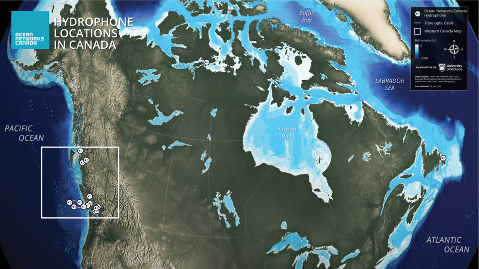
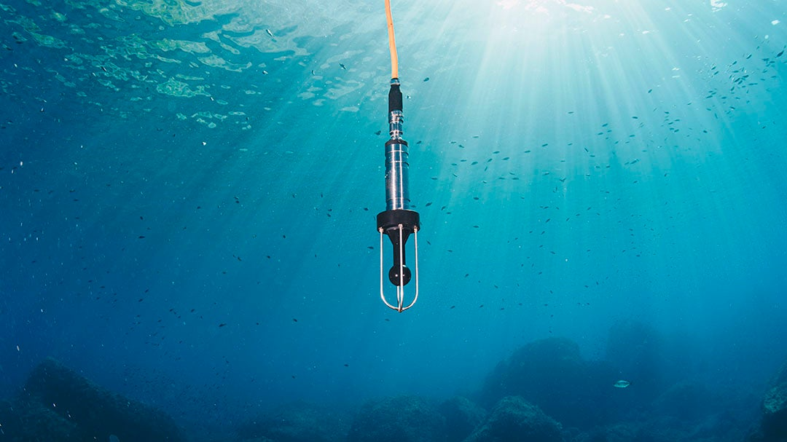

<!-- LANDING PAGE -->

---
title: "Listening to the ocean since 2006"
---

# Overview

Ocean Networks Canada has been recording the underwater soundscape since the first installation of the VENUS node in Saanich Inlet in 2006.
What started as a single location has expanded into a pan-Canadian array monitoring the Pacific, Atlantic, and Arctic coasts.

```{python}
#| echo: false
#| output: asis
import os, pandas as pd
from datetime import date
from onc.onc import ONC
from dotenv import load_dotenv
load_dotenv()

onc = ONC(os.getenv("ONC_API_TOKEN"))

# Data Retrieval
depl = pd.DataFrame(onc.getDeployments({"deviceCategoryCode": "HYDROPHONE"}))
locations = pd.DataFrame(onc.getLocations({"deviceCategoryCode": "HYDROPHONE"}))

nh = depl[depl['end'].isna()].shape[0]
today = date.today().strftime('%B %d, %Y')

print(f"As of {today}, ONC manages **{nh} active hydrophones** from coast to coast to coast.")

ojs_define(hydro_data = locations[['locationName', 'lat', 'lon', 'locationCode']])
```

::: {style="width: 80%; margin: auto;"}
{width="80%"}
:::

This handbook is an internal source for ONC's hydrophone network, spanning hardware specs, signal processing, and the lifecycle of an instrument.


# Why listening to the ocean?

Sound is the primary way we "see" in the ocean.
Because light travels poorly in water, acoustic signals are essential for navigation, communication, and monitoring the health of marine ecosystems.
Unlike several oceanic instruments, hydrophones use *passive acoustics*, hence are a non-disruptive form of monitoring the ocean soundscape.

::: {layout-ncol=1 .text-center}
{width="80%"}
:::

From **national defense** using SOSUS (sound surveillance system) to identify vessels and nuclear testing, to **resource exploration** using seismic surveys to map minerals, acoustics drive the blue economy.
These sensors can also be used to monitor **vessel traffic**, which for example is increasing in the Arctic as sea ice melts unveiling new shipping routes.


Hydrophones are also used to **track marine mammals** distribution and abundance.
Beyond biology, hydrophones can be used to detect as **earthquakes** and **seismic activity**, and even the sound of **wind** and **rain**


# Goals and future direction for passive acoustics

* Delivering science-ready (trusted) hydrophone data and data products
* Becoming a reference in terms of passive acoustics data quality assessment and calibration
* Leader in Arctic hydrophone array deployments

# Territory Acknowledgment
We recognize that marine research in the Victoria region takes place on the traditional lands of the Lək̓ʷəŋən (Lekwungen) people, known today as the Songhees and Esquimalt Nations, as well as the Xwsepsum (Esquimalt) and W̱SÁNEĆ peoples.
