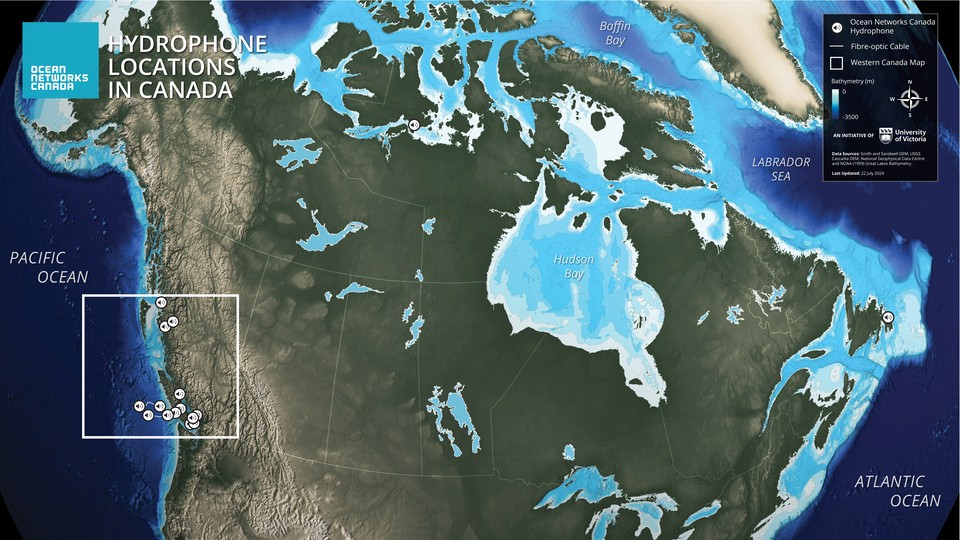

```{python}
#| echo: false
#| output: false
import os
import pandas as pd
from onc.onc import ONC
from dotenv import load_dotenv

load_dotenv()
onc = ONC(os.getenv("ONC_API_TOKEN"))
depl = pd.DataFrame(onc.getDeployments({"deviceCategoryCode": "HYDROPHONE"}))
nh = int(depl[depl['end'].isna()].shape[0])
```

*This handbook covers the entire passive acoustics program at ONC, including:
Hardware & Deployments, Data Processing & Access, Operations & Quality Control, and Scientific applications.*

# Listening to the ocean since 2006

Ocean Networks Canada has been recording the underwater soundscape since the first installation of the VENUS node in Saanich Inlet in 2006.
What started as a single location has expanded into a pan-Canadian array monitoring the Pacific, Atlantic, and Arctic coasts.

With over 1 petabyte of archived recordings, spectrograms, and derived acoustic data products, the passive acoustic program of ONC helps scientists and ocean stewards get a better understanding of the canadian ocean soundscape.

::: {.grid .kpi-grid}

::: {.g-col-12 .g-col-md-6}
::: {.kpi-card}
```{python}
#| echo: false
#| output: asis
print(f'<p class="kpi-value">{nh}</p>')
```
<p class="kpi-label">Active Hydrophones</p>
:::
:::

::: {.g-col-12 .g-col-md-6}
::: {.kpi-card}
<p class="kpi-value">3 Coasts</p>
<p class="kpi-label">Pacific, Atlantic &amp; Arctic</p>
:::
:::

:::


::: {.map-tile}
{lightbox=true width="100%"}
:::


::: {.listen-section}
### Listen to the ocean soundscape

::: {.grid .sound-card-grid}

::: {.g-col-12 .g-col-md-6}
::: {.sound-card}
::: {.sound-card-visual}
{lightbox=true group="intro-sounds" fig-alt="Spectrogram of a killer whale call." width="100%"}
:::
<p class="sound-card-title">Killer whale</p>
<p class="sound-card-caption">Calls and echolocation</p>
```{=html}
<audio class="listen-audio" controls preload="metadata">
  <source src="sounds/ICLISTENHF6325_20260712T020000.000Z_normalized.flac" type="audio/flac">
  Your browser does not support the audio player.
</audio>
```
:::
:::

::: {.g-col-12 .g-col-md-6}
::: {.sound-card}
::: {.sound-card-visual}
{lightbox=true group="intro-sounds" fig-alt="Spectrogram of sonar pings." width="100%"}
:::
<p class="sound-card-title">SONAR</p>
<p class="sound-card-caption">Active pings</p>
```{=html}
<audio class="listen-audio" controls preload="metadata">
  <source src="sounds/ICLISTENHF6016_20260602T091500.000Z_normalized.flac" type="audio/flac">
  Your browser does not support the audio player.
</audio>
```
:::
:::

:::

More recordings are on [ONC's SoundCloud](https://soundcloud.com/oceannetworkscanada).
:::

# Why listening to the ocean?

Sound is the primary way we "see" in the ocean.
Because light travels poorly in water, acoustic signals are essential for navigation, communication, and monitoring the health of marine ecosystems.
Unlike several oceanic instruments, hydrophones use *passive acoustics*, hence are a non-disruptive form of monitoring the ocean soundscape.

::: {.grid .feature-grid}

::: {.g-col-12 .g-col-md-6}
::: {.feature-card}
### 🐋 Whale monitoring
Track migration, distribution, abundance, and behaviour.
:::
:::

::: {.g-col-12 .g-col-md-6}
::: {.feature-card}
### 🚢 Ship traffic monitoring
Identify areas of increasing activity, including Arctic routes opened by sea-ice melt.
:::
:::

::: {.g-col-12 .g-col-md-6}
::: {.feature-card}
### 🛡️ National defense
SOSUS (sound surveillance system) to identify vessels and nuclear testing.
:::
:::

::: {.g-col-12 .g-col-md-6}
::: {.feature-card}
### 🌋 Seismic & geophysics
Map minerals, detect earthquakes, and support resource exploration.
:::
:::

:::

::: {.intro-hero}
{lightbox=true width="100%"}
:::


# Goals and future direction for passive acoustics

* Delivering science-ready and trusted hydrophone data and data products;
* Becoming a reference in terms of passive acoustics data quality assessment and calibration;
* Becoming leaders in Arctic hydrophone array deployments.

::: {.intro-territory}
::: {.callout-tip appearance="minimal"}
## Territory acknowledgment
We recognize that marine research in the Victoria region takes place on the traditional lands of the Lək̓ʷəŋən (Lekwungen) people, known today as the Songhees and Esquimalt Nations, as well as the Xwsepsum (Esquimalt) and W̱SÁNEĆ peoples.
:::
:::
