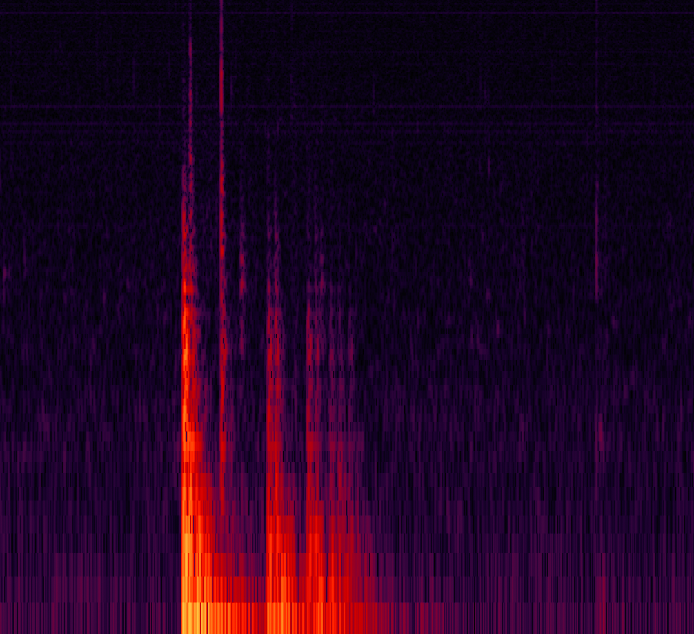
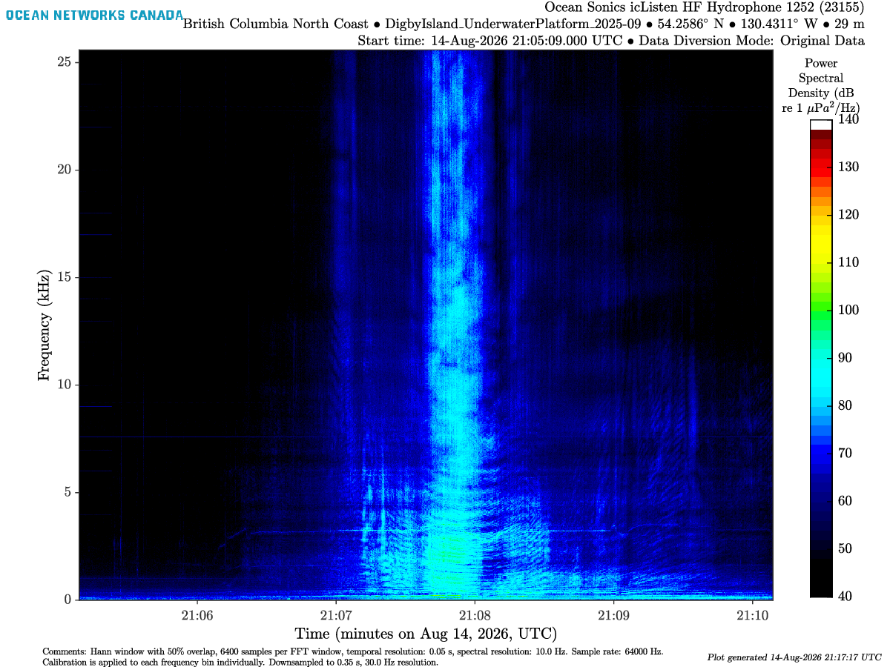
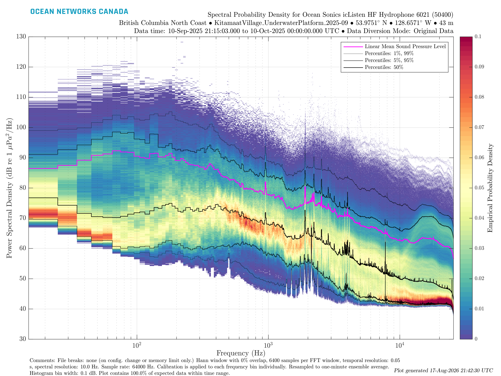
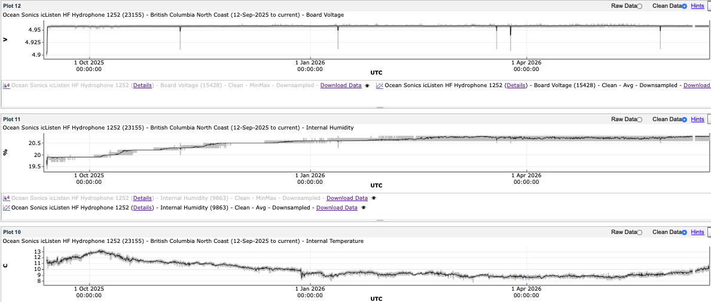

This page describes **what** each hydrophone data product contains. To download files, use the [Data Access](12-data-access.qmd) request builder or Hydrophone Viewer.

# Overview

Hydrophone data is archived several formats, ranging from raw acoustic recordings to processed spectral products.

Each device has a collection of files for every 5 minutes of recording:

| Description |  Data Product Code | Data Product ID | File Extension |
|---------|-----|---|---|
Raw Audio Data (lossless) |  AD | 7 | .flac
Raw Audio Data (lossless)| AD | 7 | .wav 
Raw Audio Data (with loss) | AD | 7 | .mp3
Hydrophone Array Raw Data (IOS arrays, retired) | HARD | 38 | .hyd
Proprietary Spectral Data (Ocean Sonics only) | HSD  | 45 | .fft
Processed Spectral Data  | HSD | 45 | .mat
Spectrogram | HSD | 45 | .png, .pdf
1/3-octave spectral data (JASCO / GeoSpectrum) | HSD | 45 | .oct
Spectral Probability Density | HSPD | 51 | .png, .pdf, .mat
Log / auxiliary file | LF | 4 | .txt
Hydrophone Acceleration Data | HACC | 128 | .acc

: Archived formats for hydrophone data.

\

Note that both **Data Product Code** and **File Extension** are needed when downloading data through the API.
Each data product (`dataProductCode`) has a set of data product options (`dpo_*`) that can be used to narrow down the request.

# Audio Data

::: {.dp-panel}

::: {.dp-split}

::: {.dp-visual}

:::

::: {.dp-copy}

```{=html}
<div class="dp-meta">
  <span class="dp-pill"><span class="dp-pill-k">Data Product Code</span> AD / 7</span>
  <span class="dp-pill"><span class="dp-pill-k">Available Formats</span> .flac, .wav, .mp3</span>
</div>
```

Audio data is the raw recording of the acoustic environment.

Older files were stored as `.wav`, but ONC now archives lossless `.flac`. The `.mp3` format is smaller but lossy, and is not recommended for scientific work.
Retired IOS arrays used HARD / 38 (`.hyd`) instead of AD.

Why FLAC is the preferred format?

* **Lossless compression**: unlike MP3, FLAC keeps 100% of the original samples.
* **Storage efficiency**: files are substantially smaller than `.wav` at the same quality.
* **Metadata**: FLAC can store deployment and device tags inside the file.

:::

:::

::: {.callout-note collapse="true"}
## Expand for API options

* `dpo_audioDownsample`: `"-1"` (default, native rate), `"256"`, `"512"`, `"2000"`, `"4000"`, `"8000"`, `"16000"`, `"44100"`, `"48000"`
* `dpo_audioFormatConversion`: `"0"` (default), `"1"`
* `dpo_hydrophoneAcquisitionMode`: `"All"` (default), `"LF"`, `"HF"`
* `dpo_hydrophoneChannel`: `"H1"` (default), `"H2"`, `"H3"`, `"All"`
* `dpo_hydrophoneDataDiversionMode`: `"OD"` (default, original data), `"LPF"`, `"HPF"`, `"All"`
:::

:::

# Hydrophone Spectral Data

::: {.dp-panel}

::: {.dp-split}

::: {.dp-visual}

:::

::: {.dp-copy}

```{=html}
<div class="dp-meta">
  <span class="dp-pill"><span class="dp-pill-k">Data Product Code</span> HSD / 45</span>
  <span class="dp-pill"><span class="dp-pill-k">Available Formats</span> .mat, .png, .pdf, .fft</span>
</div>
```

Spectral products turn audio files into frequency vs time data. To access the data, one can go to the Hydrophone Viewer where each 5-min audio file was turned into a spectrogram (.png).
This data product is a practical way for quick-checks without processing terabytes of raw audio. It comes in several formats:

**`.mat` — processed spectral data.** MATLAB data format of 1-minute averaged calibrated spectral data with the device-specific sensitivity curve. Contains a `SpectData` structure with frequency bins (Hz) and power spectral density.

**`.png` / `.pdf` — spectrogram.** A 2D heatmap of sound: time on the x-axis, frequency (Hz) on the y-axis, colour as sound level in $\text{dB re } 1~\mu\mathrm{Pa}^2/\mathrm{Hz}$.

**`.fft` — proprietary spectral data (Ocean Sonics only).** Broadband spectrogram files, roughly a raw version of the plot. They use a single broadband sensitivity (around −165 to −170 dB) rather than a frequency-dependent calibration curve, so they are preliminary and unfit for scientific research.

:::

:::


::: {.callout-tip collapse="true"}
## Expand to learn more about the method

A spectrogram is built from short Fourier transforms of the audio:

1. **Time windowing**: raw audio is split into finite segments with a window (ONC uses a Hann window) to limit spectral leakage.
2. **FFT**: each segment is transformed from the time domain to the frequency domain.
3. **Overlap / averaging**: successive windows overlap (typically 50%) so energy at the edges is not lost.
4. **Calibration**: values are converted to micropascals with the device-specific **frequency-dependent calibration curve**. Using the wrong curve has caused errors in the past ([internal note](https://internal.oceannetworks.ca/spaces/ONCData/pages/255101693/1.+Power+spectral+density+vs.+power+spectrum.)).

Fourier transforms assume an infinite, stationary signal. A finite cut creates edge discontinuities and **spectral leakage** into neighbouring bins. Windowing (tapering) multiplies the segment by a shape that goes to zero at the edges.

Choosing the right window is not easy due to the Heisenberg uncertainty principle: you cannot have perfect time and frequency resolution at once.

* **Narrow window**: good time resolution (when a click happened), poor frequency resolution.
* **Wide window**: good frequency resolution (harmonics of a call), poor time resolution.
* Wavelengths longer than the window are lost.

ONC spectrogram settings in the example above:

* Hann window with 50% overlap
* 6400 samples per FFT window
* Temporal resolution: 0.05 s
* Sample rate: 64000 Hz
:::

::: {.callout-note collapse="true"}
## Expand for API options

* `dpo_hydrophoneAcquisitionMode`: `"All"` (default), `"LF"`, `"HF"`
* `dpo_hydrophoneChannel`: `"H1"` (default), `"H2"`, `"H3"`, `"All"`
* `dpo_hydrophoneDataDiversionMode`: `"OD"` (default, original data), `"LPF"`, `"HPF"`, `"All"`
* `dpo_spectrogramSource` (PNG/PDF): `"MIX"` (default, audio preferred, FFT fills gaps), `"WAVFLAC"`, `"FFT"`
* `dpo_spectrogramConcatenation`: `"None"` (default for PNG/PDF), `"Concatenate"` (default for MAT), `"Daily"`, `"Weekly"`, `"Adjacent"` (PNG/PDF, searches of 5 minutes or less)
* `dpo_spectralDataDownsample` (MAT): `"1"` (default, one-minute, pre-generated), `"2"` (spectrogram resolution), `"0"` (full resolution)
* `dpo_spectrogramColourPalette` (PNG/PDF): `"0"` (default), `"1"`, `"2"`, `"3"`, `"4"`, `"5"`
* `dpo_lowerColourLimit` / `dpo_upperColourLimit` (PNG/PDF): `"-1000"` (default, use device calibration); otherwise −160 to 140
* `dpo_spectrogramFrequencyUpperLimit` (PNG/PDF): `"-1"` (default, use calibration / sample rate); otherwise 100 to 500000 Hz
:::

:::

# Spectral Probability Density

::: {.dp-panel}

::: {.dp-split}

::: {.dp-visual}

:::

::: {.dp-copy}

```{=html}
<div class="dp-meta">
  <span class="dp-pill"><span class="dp-pill-k">Data Product Code</span> HSPD / 51</span>
  <span class="dp-pill"><span class="dp-pill-k">Available Formats</span> .png, .pdf, .mat</span>
</div>
```

The Spectral Probability Density is a statistical view of long-term ambient noise, originally proposed by [Merchant et al. (2013)](https://pubs.aip.org/asa/jasa/article/133/4/EL262/917238/Spectral-probability-density-as-a-tool-for-ambient). It counts how often a given dB level occurs in each frequency bin. Use it to see the persistent noise floor rather than a single 5-minute snapshot.

:::

:::

::: {.callout-tip collapse="true"}
## Expand to learn more about the method

The mean square value in frequency range $(f, \Delta f)$ is:

$$
\Psi^2_x(f,\Delta f) = \lim_{T\rightarrow \infty} \frac{1}{T} \int_0^T x(t,f,\Delta f)^2 dt
$$

Power spectral density is approximately $\Psi^2_x(f,\Delta f) \approx G_x(f) \Delta f$:

$$
G_x(f) = \lim_{\Delta f \rightarrow 0} \frac{\Psi^2_x(f,\Delta f)}{\Delta f} = \lim_{\Delta f\rightarrow 0} \frac{1}{\Delta f} \left[ \lim_{T\rightarrow \infty} \frac{1}{T} \int_0^T x(t,f,\Delta f)^2 dt \right]
$$

HSPD then histograms those levels per frequency bin over a long window, so the colour is occupancy (how often that level occurs), not a single spectrogram frame.
:::

::: {.callout-note collapse="true"}
## Expand for API options

* `dpo_filePlotBreaks`: `"0"` None (configuration changes only), `"1"` Daily, `"2"` Weekly (default), `"3"` Hourly, `"4"` Monthly, `"5"` Yearly
* `dpo_hydrophoneAcquisitionMode`: `"All"` (default), `"LF"`, `"HF"`
* `dpo_hydrophoneChannel`: `"H1"` (default), `"H2"`, `"H3"`, `"All"`
* `dpo_hydrophoneDataDiversionMode`: `"OD"` (default, original data), `"LPF"`, `"HPF"`, `"All"`
* `dpo_spectralProbabilityDensityColourAxisUpperLimit`: `"0"` (default), `"0.05"`, `"0.1"`, `"0.12"`, `"0.25"`, `"0.5"`, `"1.0"`
* `dpo_spectralProbabilityDensityPSDRange`: `"0"` (default), `"40_160"`, `"40_140"`, `"20_140"`
:::

:::

# Auxiliary Data

::: {.dp-panel}

::: {.dp-split}

::: {.dp-visual}

:::

::: {.dp-copy}

```{=html}
<div class="dp-meta">
  <span class="dp-pill"><span class="dp-pill-k">Data Product Code</span> LF / 4 · HACC / 128</span>
  <span class="dp-pill"><span class="dp-pill-k">Available Formats</span> .txt, .acc</span>
</div>
```

Auxiliary (ancillary) files are about the instrument, not the soundscape: internal humidity, temperature, battery, voltage, and related engineering scalars. Use them to diagnose leakage (humidity above about 50%), overheating, or a dying battery. Magnetic flux and acceleration can also indicate orientation and strong currents.

These data are only available for Ocean Sonics hydrophones.

:::

:::

::: {.callout-note collapse="true"}
## Expand for API options

LF (`.txt`) and HACC (`.acc`) have no extra `dpo_*` options. There is no single `AUX` code: order **LF** for the engineering log and **HACC** for acceleration. Calibration files use **HCF**.
:::

:::

# Useful links

```{=html}
<div class="docs-card">
  <div class="docs-card-title">
    
    <span>Confluence Documentation</span>
  </div>
  <ul class="docs-card-list">
    <li><a href="https://internal.oceannetworks.ca/spaces/DS/pages/7639165/Hydrophone+Matlab+Postprocess+Jobs">Hydrophone MATLAB Post-process Jobs</a></li>
    <li><a href="https://wiki.oceannetworks.ca/spaces/DP/pages/21758104/7">Data Product: Audio Data (7)</a></li>
    <li><a href="https://wiki.oceannetworks.ca/spaces/DP/pages/42174569/45">Data Product: Hydrophone Spectral Data (45)</a></li>
    <li><a href="https://wiki.oceannetworks.ca/spaces/DP/pages/46990690/51">Data Product: Hydrophone Spectral Probability Density (51)</a></li>
    <li><a href="https://wiki.oceannetworks.ca/spaces/DP/pages/78414511/146">Data Product: Spectrogram For Hydrophone Viewer (146)</a></li>
    <li><a href="https://wiki.oceannetworks.ca/spaces/DP/pages/78414074/128">Data Product: Hydrophone Acceleration Data (128)</a></li>
    <li><a href="https://wiki.oceannetworks.ca/spaces/DP/pages/21758026/4">Data Product: Log File (4)</a></li>
    <li><a href="https://internal.oceannetworks.ca/spaces/ONCData/pages/216205790/Passive+acoustics">Passive acoustics data products (internal)</a></li>
  </ul>
</div>
```
