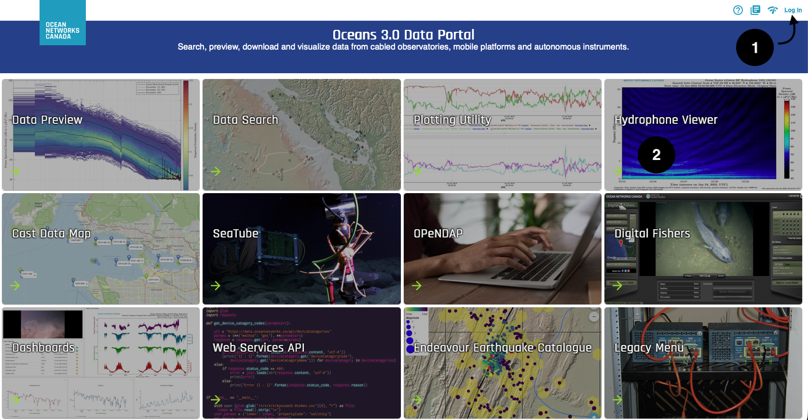
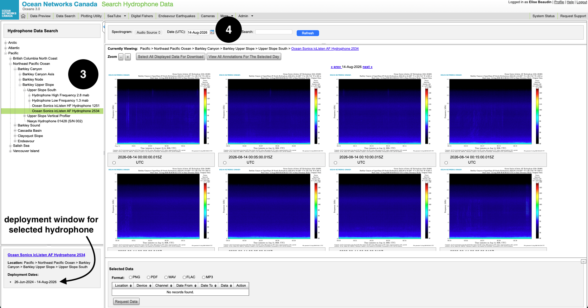
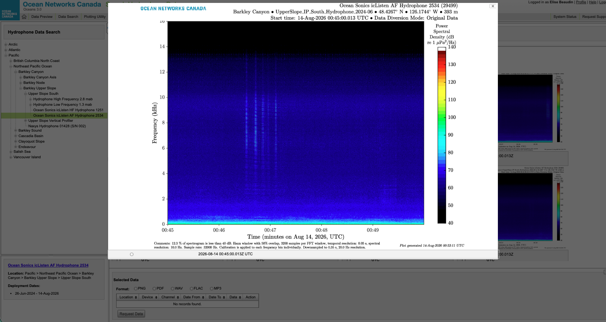
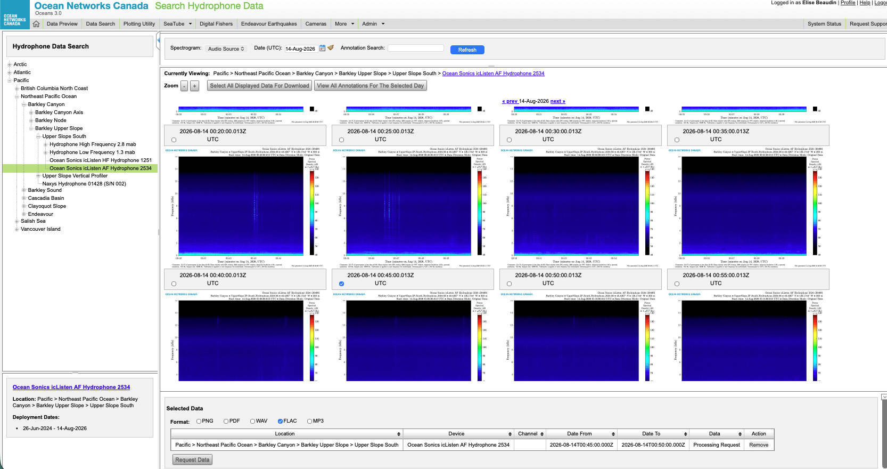

*This page is about **how to get hydrophone data**. For what each file type contains, see [Data Products](11-data-products.qmd).*

# Which method to use?
There are 2 ways to get the data: from ONC data portal [Oceans3.0](https://data.oceannetworks.ca), or using the ONC API.


The Hydrophone Viewer is for browsing the pre-generated 5-min spectrograms, and quick downloads to any format including audio.
It is best for a first look, or sound hunting through visualizing the data.
Use this when you want to *see* the soundscape before you download files.

Use the API when you need more than a handful of files, or a data product with specific settings.

Use [this link](https://hydrophone-data-availability.streamlit.app) to find hydrophone data availability.

::: {.panel-tabset .access-tabs}

## Hydrophone Viewer


### 1. Log in to Oceans 3.0

Visit [https://data.oceannetworks.ca](https://data.oceannetworks.ca/) and sign in with your ONC account.

### 2. Select Hydrophone Viewer

{lightbox=true}

### 3. Choose a location or a hydrophone

From **Hydrophone Viewer**, a list of location will appear on the left panel, under Hydrophone Data Search. 

Pick a location. Go down the tree until you can select a device.
Note that each hydrophone has a dedicated *device name*, which are often a combination of their manufacturer/supplier and a serial number (*ex: Ocean Sonics icListen HF Hydrophone 1251*).

The deployment window of each device is listed at the bottom.
This information is important, as you will not be able to find data outside of the deployment window.
If there are multiple devices under a location, the deployment windows go from top to bottom in chronological order.
The most recent hydrophone in the water at this site is the last one of the list.

For hydrophone arrays, hydrophones are under Hydrophone A, B, C or D.

Navigate to the [hydrophone network](8-hydrophone-network.qmd) page to find past and current deployments.

{lightbox=true}

### 4. Choose a date
The date has in the following format: 01-Jan-2026.
If a message pops up saying No Data, it either means the selected date is outside the deployment window, or the hydrophone did not record that day due to some issues.


### 5. Inspect the spectrogram

Each spectrogram is a visual representation of the soundspace over a 5-min time window. You can click on a spectrogram and it will size up.

{lightbox=true}


### 6. Data download

When you want the underlying data (FLAC, MAT, PNG, …), you can select a spectrogram by checking the box underneath it.

In the window at the bottom, select a file format (select FLAC for lossless compressed audio file), and hit Request Data. This can take up to 2 minutes for larger files.
Once the request has been completed, "Processing Request" becomes a Download that you can hit to retrieve your file.

You can request multiple files at once.

{lightbox=true}


## API (advanced)

### 1. Get an Oceans 3.0 API Token
Visit [Oceans 3.0 profile](https://data.oceannetworks.ca/Profile) (Web Services API tab).

### 2. Install the ONC API package

* Python: in the terminal, type `pip install onc`
* MATLAB: use the [Ocean Networks Canada MATLAB Client Library](https://www.mathworks.com/matlabcentral/fileexchange/74065-ocean-networks-canada-api-client-library)

### 3. Archive or order data product?

* **Archive**: files that already exist on ONC's disks, like raw audio files, pre-generated spectrograms, or instrument logs.
Files are archived almost near-real-time. Downloading using this option is usually much faster.

* **Order data product**: Oceans 3.0 can *build a new file for you*, with several options to pick from, including resampled audio files or a spectrogram with your own colour limits or frequency range.
Depending on the request, it can take anywhere from a minute to several hours.

A simple rule: **if an existing file would do, use Archive.**

### 4. Select a location or a device
Requests are filtered **by location** (`locationCode`, always with `deviceCategoryCode = HYDROPHONE`) or **by device** (`deviceCode`). Location follows whichever instrument was deployed there; device follows one specific instrument across its deployments.

Visit the [Hydrophone Network](8-hydrophone-network.qmd) page to find location or device codes of past and current deployments.

### The API helper

```{python}
#| echo: false
import json
import os
from pathlib import Path
from IPython.display import HTML, display

from dotenv import load_dotenv

load_dotenv()

FALLBACK_PRODUCTS = [
    {
        "code": "AD",
        "name": "Audio Data",
        "formats": [
            {
                "extension": "flac",
                "options": [
                    {"option": "dpo_audioDownsample", "allowableValues": ["-1", "512", "256", "2000", "4000", "8000", "16000", "44100", "48000"], "defaultValue": "-1"},
                    {"option": "dpo_hydrophoneAcquisitionMode", "allowableValues": ["All", "LF", "HF"], "defaultValue": "All"},
                    {"option": "dpo_hydrophoneChannel", "allowableValues": ["H1", "H2", "H3", "All"], "defaultValue": "H1"},
                    {"option": "dpo_hydrophoneDataDiversionMode", "allowableValues": ["OD", "LPF", "HPF", "All"], "defaultValue": "OD"},
                ],
            },
            {
                "extension": "wav",
                "options": [
                    {"option": "dpo_audioDownsample", "allowableValues": ["-1", "512", "256", "2000", "4000", "8000", "16000", "44100", "48000"], "defaultValue": "-1"},
                    {"option": "dpo_audioFormatConversion", "allowableValues": ["0", "1"], "defaultValue": "0"},
                    {"option": "dpo_hydrophoneAcquisitionMode", "allowableValues": ["All", "LF", "HF"], "defaultValue": "All"},
                    {"option": "dpo_hydrophoneChannel", "allowableValues": ["H1", "H2", "H3", "All"], "defaultValue": "H1"},
                    {"option": "dpo_hydrophoneDataDiversionMode", "allowableValues": ["OD", "LPF", "HPF", "All"], "defaultValue": "OD"},
                ],
            },
            {
                "extension": "mp3",
                "options": [
                    {"option": "dpo_hydrophoneAcquisitionMode", "allowableValues": ["All", "LF", "HF"], "defaultValue": "All"},
                    {"option": "dpo_hydrophoneChannel", "allowableValues": ["H1", "H2", "H3", "All"], "defaultValue": "H1"},
                    {"option": "dpo_hydrophoneDataDiversionMode", "allowableValues": ["OD", "LPF", "HPF", "All"], "defaultValue": "OD"},
                ],
            },
        ],
    },
    {
        "code": "HSD",
        "name": "Hydrophone Spectral Data",
        "formats": [
            {
                "extension": "mat",
                "options": [
                    {"option": "dpo_hydrophoneAcquisitionMode", "allowableValues": ["All", "LF", "HF"], "defaultValue": "All"},
                    {"option": "dpo_hydrophoneChannel", "allowableValues": ["H1", "H2", "H3", "All"], "defaultValue": "H1"},
                    {"option": "dpo_hydrophoneDataDiversionMode", "allowableValues": ["OD", "LPF", "HPF", "All"], "defaultValue": "OD"},
                    {"option": "dpo_spectralDataDownsample", "allowableValues": ["0", "1", "2"], "defaultValue": "1"},
                    {"option": "dpo_spectrogramConcatenation", "allowableValues": ["Daily", "Concatenate", "None"], "defaultValue": "Concatenate"},
                ],
            },
            {
                "extension": "fft",
                "options": [],
            },
            {
                "extension": "png",
                "options": [
                    {"option": "dpo_hydrophoneAcquisitionMode", "allowableValues": ["All", "LF", "HF"], "defaultValue": "All"},
                    {"option": "dpo_hydrophoneChannel", "allowableValues": ["H1", "H2", "H3", "All"], "defaultValue": "H1"},
                    {"option": "dpo_hydrophoneDataDiversionMode", "allowableValues": ["OD", "LPF", "HPF", "All"], "defaultValue": "OD"},
                    {"option": "dpo_lowerColourLimit", "allowableRange": {"lowerBound": "-160", "upperBound": "140"}, "allowableValues": ["-1000"], "defaultValue": "-1000"},
                    {"option": "dpo_upperColourLimit", "allowableRange": {"lowerBound": "-160", "upperBound": "140"}, "allowableValues": ["-1000"], "defaultValue": "-1000"},
                    {"option": "dpo_spectrogramColourPalette", "allowableValues": ["0", "1", "2", "3", "4", "5"], "defaultValue": "0"},
                    {"option": "dpo_spectrogramConcatenation", "allowableValues": ["None", "Daily", "Weekly", "Adjacent"], "defaultValue": "None"},
                    {"option": "dpo_spectrogramFrequencyUpperLimit", "allowableValues": ["-1", "1000", "10000"], "allowableRange": {"lowerBound": "100", "upperBound": "500000"}, "defaultValue": "-1"},
                    {"option": "dpo_spectrogramSource", "allowableValues": ["MIX", "WAVFLAC", "FFT"], "defaultValue": "MIX"},
                ],
            },
        ],
    },
    {
        "code": "HSPD",
        "name": "Hydrophone Spectral Probability Density",
        "formats": [
            {
                "extension": "png",
                "options": [
                    {"option": "dpo_filePlotBreaks", "allowableValues": ["0", "1", "2", "3", "4", "5"], "defaultValue": "2"},
                    {"option": "dpo_hydrophoneAcquisitionMode", "allowableValues": ["All", "LF", "HF"], "defaultValue": "All"},
                    {"option": "dpo_hydrophoneChannel", "allowableValues": ["H1", "H2", "H3", "All"], "defaultValue": "H1"},
                    {"option": "dpo_hydrophoneDataDiversionMode", "allowableValues": ["OD", "LPF", "HPF", "All"], "defaultValue": "OD"},
                    {"option": "dpo_spectralProbabilityDensityColourAxisUpperLimit", "allowableValues": ["0", "0.05", "0.1", "0.12", "0.25", "0.5", "1.0"], "defaultValue": "0"},
                    {"option": "dpo_spectralProbabilityDensityPSDRange", "allowableValues": ["0", "40_160", "40_140", "20_140"], "defaultValue": "0"},
                ],
            }
        ],
    },
    {
        "code": "LF",
        "name": "Log File",
        "formats": [{"extension": "txt", "options": []}],
    },
]


def _slim_option(opt):
    range_info = opt.get("allowableRange")
    if isinstance(range_info, list) and range_info:
        range_info = range_info[0]
    return {
        "option": opt.get("option"),
        "allowableValues": opt.get("allowableValues") or [],
        "allowableRange": range_info,
        "defaultValue": opt.get("defaultValue") or opt.get("defaultValues"),
    }


def _merge_options(opts):
    """Collapse repeated option entries down to one usable entry per option name.

    Oceans 3.0 lists an option once per device context it applies to, so the same
    name can appear several times with different allowable values. Unioning them
    invents combinations no single device accepts (dpo_resample would gain "15"
    from the Thompson Detided product), so keep the widest single entry instead.
    """
    merged = {}
    for opt in opts or []:
        name = opt.get("option")
        if not name:
            continue
        slim = _slim_option(opt)
        current = merged.get(name)
        if current is None or len(slim.get("allowableValues") or []) > len(current.get("allowableValues") or []):
            if current is not None and not slim.get("allowableRange"):
                slim["allowableRange"] = current.get("allowableRange")
            merged[name] = slim
        elif not current.get("allowableRange") and slim.get("allowableRange"):
            current["allowableRange"] = slim["allowableRange"]
    return list(merged.values())


def _group_products(raw):
    grouped = {}
    for row in raw or []:
        code = row.get("dataProductCode")
        if not code:
            continue
        grouped.setdefault(code, {
            "code": code,
            "name": row.get("dataProductName") or code,
            "formats": [],
        })
        ext = row.get("extension")
        if not ext:
            continue
        formats = grouped[code]["formats"]
        if any(f["extension"] == ext for f in formats):
            continue
        formats.append({
            "extension": ext,
            "options": _merge_options(row.get("dataProductOptions") or []),
        })
    return list(grouped.values())


def _load_location_names():
    names = {}
    path = Path("../notebooks/location_names.txt")
    if not path.exists():
        path = Path("notebooks/location_names.txt")
    if path.exists():
        for line in path.read_text().splitlines():
            parts = [p.strip() for p in line.split(",", 1)]
            if parts and parts[0]:
                names[parts[0]] = parts[1] if len(parts) > 1 and parts[1] else parts[0]
    return names


def _unique(items, key):
    seen = {}
    for item in items:
        k = item.get(key)
        if k:
            seen[k] = item
    return list(seen.values())


def _fallback_locations(names):
    locations = []
    csv_path = Path("../notebooks/hydrophone_locations.csv")
    if not csv_path.exists():
        csv_path = Path("notebooks/hydrophone_locations.csv")
    if csv_path.exists():
        import pandas as pd
        df = pd.read_csv(csv_path)
        for _, row in df.iterrows():
            code = str(row["locationCode"])
            locations.append({
                "locationCode": code,
                "locationName": str(row.get("locationName") or names.get(code, code)).strip(),
            })
    elif names:
        locations = [{"locationCode": k, "locationName": v} for k, v in names.items()]
    return locations


names = _load_location_names()
deployments = []
devices = []
locations = []
products = FALLBACK_PRODUCTS
source = "handbook fallback catalog"

token = os.getenv("ONC_API_TOKEN")
if token:
    try:
        from onc.onc import ONC
        onc = ONC(token)
        raw_depl = onc.getDeployments({"deviceCategoryCode": "HYDROPHONE"})
        raw_products = onc.getDataProducts({"deviceCategoryCode": "HYDROPHONE"})
        for d in raw_depl:
            loc = d.get("locationCode")
            dev = d.get("deviceCode")
            if not loc or not dev:
                continue
            deployments.append({
                "locationCode": loc,
                "locationName": names.get(loc, loc),
                "deviceCode": dev,
                "begin": d.get("begin"),
                "end": d.get("end"),
                "active": d.get("end") in (None, ""),
            })
        locations = [{"locationCode": d["locationCode"], "locationName": d["locationName"]} for d in deployments]
        devices = [{"deviceCode": d["deviceCode"]} for d in deployments]
        grouped = _group_products(raw_products)
        if grouped:
            products = grouped
        source = "Oceans 3.0 API (deviceCategoryCode=HYDROPHONE)"
    except Exception:
        locations = _fallback_locations(names)

# SHV is built for the Hydrophone Viewer and cannot be ordered through the API.
HYDRO_PRODUCTS = ["AD", "HSD", "HSPD", "LF", "HCF", "HACC", "HARD", "TSSD"]
products = [p for p in products if p["code"] in HYDRO_PRODUCTS]
products.sort(key=lambda p: (HYDRO_PRODUCTS.index(p["code"]), p["name"]))

if not locations:
    locations = _fallback_locations(names)
locations = _unique(locations, "locationCode")
locations.sort(key=lambda x: (x.get("locationName") or x["locationCode"]).lower())
if not devices:
    devices = [{"deviceCode": d["deviceCode"]} for d in deployments]
devices = _unique(devices, "deviceCode")
devices.sort(key=lambda x: x["deviceCode"])

catalog = {
    "source": source,
    "locations": locations,
    "devices": devices,
    "deployments": deployments,
    "products": products,
}

payload = json.dumps(catalog, separators=(",", ":"))
display(HTML(f'<script type="application/json" id="onc-hydro-catalog">{payload}</script>'))
display(HTML(f'<p class="api-hint">Catalog source: {source}.</p>'))
```

```{=html}
<form id="api-builder" class="api-builder" autocomplete="off">
  <div class="api-row">
    <div class="api-row-label">
      <label for="api-location">What to query</label>
      <p class="api-hint">Find location or device codes on the Hydrophone Network page.</p>
    </div>
    <div class="api-row-body">
      <div class="api-segment" role="group" aria-label="Query by">
        <label class="api-segment-item">
          <input type="radio" name="api-lookup" value="location" checked>
          <span>By location</span>
        </label>
        <label class="api-segment-item">
          <input type="radio" name="api-lookup" value="device">
          <span>By device</span>
        </label>
      </div>
      <input id="api-location" type="text" list="api-location-list" placeholder="Location code, e.g. CQSH.H1" aria-label="Location code">
      <datalist id="api-location-list"></datalist>
      <input id="api-device" type="text" list="api-device-list" placeholder="Device code, e.g. ICLISTENHF6016" aria-label="Device code" hidden>
      <datalist id="api-device-list"></datalist>
    </div>
  </div>

  <div class="api-row">
    <div class="api-row-label">
      <label for="api-date-from">Time range (UTC)</label>
      <p class="api-hint">24-hour clock, <code>YYYY-MM-DD HH:MM</code>.</p>
    </div>
    <div class="api-row-body">
      <div class="api-row-body-split">
        <label class="api-field">
          <span>From</span>
          <input id="api-date-from" type="text" placeholder="2023-06-01 00:00" spellcheck="false">
        </label>
        <label class="api-field">
          <span>To</span>
          <input id="api-date-to" type="text" placeholder="2023-06-01 00:05" spellcheck="false">
        </label>
      </div>
      <p class="api-hint api-error" id="api-date-hint"></p>
    </div>
  </div>

  <div class="api-row">
    <div class="api-row-label">
      <span>Source</span>
      <p class="api-hint">See "Archive or data product?" above.</p>
    </div>
    <div class="api-row-body">
      <div class="api-choices" role="radiogroup" aria-label="Source">
        <label class="api-choice">
          <input type="radio" name="api-method" value="archive" checked>
          <span class="api-choice-body">
            <strong>Archive files</strong>
            <small>Files that already exist. Downloads immediately, no options to set.</small>
          </span>
        </label>
        <label class="api-choice">
          <input type="radio" name="api-method" value="order">
          <span class="api-choice-body">
            <strong>Custom data product</strong>
            <small>ONC builds the file for you. Queued, minutes to hours, fully configurable.</small>
          </span>
        </label>
      </div>
    </div>
  </div>

  <div class="api-row" data-panel="archive">
    <div class="api-row-label">
      <label for="api-archive-ext">Files</label>
    </div>
    <div class="api-row-body">
      <div class="api-row-body-split">
        <select id="api-archive-ext" aria-label="File extension"></select>
        <select id="api-archive-action" aria-label="Action">
          <option value="download" selected>Download the matching files</option>
          <option value="list">Just list what exists</option>
        </select>
      </div>
      <p class="api-hint" id="api-archive-hint"></p>
    </div>
  </div>

  <div class="api-row" data-panel="order" hidden>
    <div class="api-row-label">
      <label for="api-product">Product</label>
    </div>
    <div class="api-row-body">
      <div class="api-row-body-split">
        <select id="api-product" aria-label="Data product"></select>
        <select id="api-order-ext" aria-label="Extension"></select>
      </div>
      <p class="api-hint" id="api-product-hint"></p>
      <label class="api-check">
        <input id="api-include-meta" type="checkbox" checked>
        <span>Include the metadata file describing how the product was made</span>
      </label>
      <details class="api-details">
        <summary><span id="api-dpo-summary">Advanced options</span></summary>
        <p class="api-hint">Anything left at its default is omitted from the request, so Oceans 3.0 applies the right default for that instrument.</p>
        <div id="api-dpo-fields" class="api-dpo-list"></div>
      </details>
    </div>
  </div>
  
</form>

<div class="api-output">
  <div class="api-toolbar">
    <button type="button" class="api-tab active" data-lang="python">Python</button>
    <button type="button" class="api-tab" data-lang="matlab">MATLAB</button>
    <button type="button" class="api-tab" data-lang="curl">curl</button>
    <button type="button" class="api-copy" id="api-copy">Copy</button>
  </div>
  <pre id="api-code-python" class="api-code"></pre>
  <pre id="api-code-matlab" class="api-code" hidden></pre>
  <pre id="api-code-curl" class="api-code" hidden></pre>
</div>

<script src="../scripts/api-builder.js"></script>
```

OpenAPI reference: [https://data.oceannetworks.ca/OpenAPI](https://data.oceannetworks.ca/OpenAPI). Client docs: [Python](https://oceannetworkscanada.github.io/api-python-client/) · [MATLAB](https://github.com/OceanNetworksCanada/api-matlab-client).

:::

