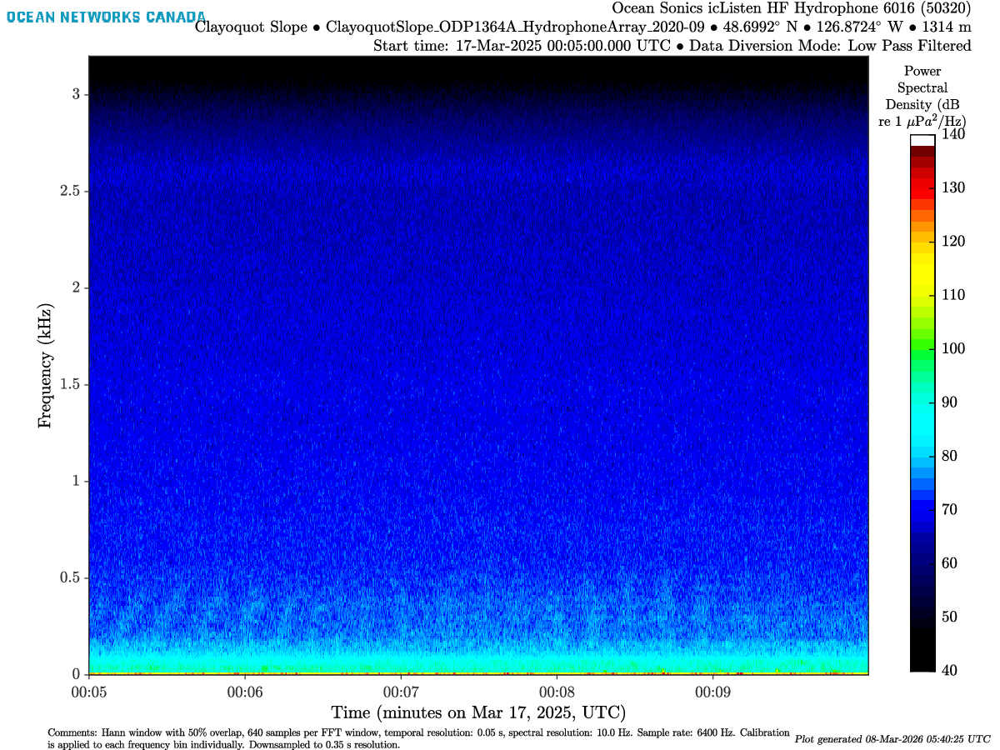

# Tier 1 Instruments
Underwater acoustics data may reveal sensitive information that poses national security concerns.
Hydrophones, alongside Accelerometers, Seismometers, Tiltmeters, and Magnetometers, are classified as **Tier 1** instruments.

Therefore, the passive acoustic data stream may be re-routed through a Data Diversion System (DDS) controlled by the Royal Canadian Navy (RCN) and US Navy (USN) to screen for sensitive maritime activity.
These divert periods can range from minutes to days or even weeks.

During diversion, full-band audio files (WAV/FLAC) are diverted directly to naval screening facilities, and the data is released back later to ONC either untouched, high-passed-filtered (HPF), or low-passed-filtered (LPF).
"HPF-" and "LPF-" suffixes are then incorporated into the file name (ex: ICLISTENHF6016_20250317T000500.000Z-LPF.flac).




Notifications regarding planned or active diversions are managed via a restricted mailing list reserved strictly for cleared personnel.


# Useful links

```{=html}
<div style="border: 1px solid rgba(255, 255, 255, 0.2); 
            border-radius: 8px; 
            padding: 16px; 
            background: rgba(255, 255, 255, 0.05); 
            margin-top: 15px;
            backdrop-filter: blur(5px);
            color: white;">

  <div style="display: flex; align-items: center; gap: 12px; margin-bottom: 12px;">
    
    <span style="font-weight: bold; font-size: 1.1em; letter-spacing: 0.3px;">
      Confluence Documentation
    </span>
  </div>

  <ul style="list-style-type: none; padding-left: 36px; margin: 0;">
    
    <li style="margin-bottom: 10px;">
      <a href="https://wiki.oceannetworks.ca/spaces/DP/pages/42174740/Diversion+of+Tier+1+data" 
         style="color: #82caff; text-decoration: none; font-weight: 500; border-bottom: 1px solid rgba(130, 202, 255, 0.3);">
         Diversion of Tier 1 data
      </a>
	</li>

  </ul>
</div>
```


