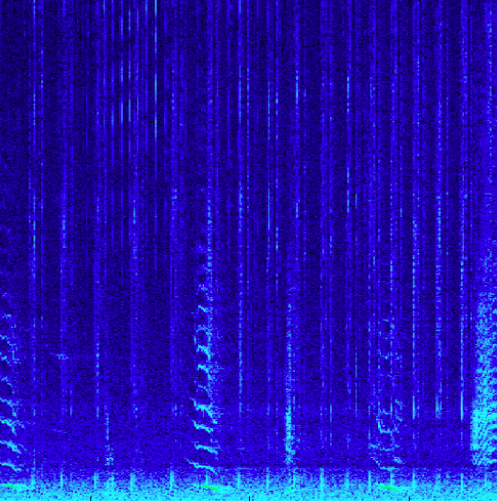

# Science

## Marine mammals monitoring

In 2015, ONC joined the Enhancing Cetacean and Habitat Observation ([ECHO](https://www.portvancouver.com/environment/healthy-ecosystem/echo)) Program which aim at investigating ways to reduce shipping traffic impacts on whale activity in the Straight of Georgia.
As part of the program, hydrophone arrays from *JASCO Applied Science* were deployed and the data ingested in ONC’s servers.

The program has known quite a bit of success, as thousands of ships have voluntarily reduced speed or distanced themselves from whales.

*Read ONC’s story [here](https://www.oceannetworks.ca/news-and-stories/stories/listening-to-deep-ocean-whales/).*

Since then, ONC has kept expanding its hydrophone network which has turned into more partnerships with BC in 2017, to study ship traffic in Haro Strait ([read story here](https://www.oceannetworks.ca/news-and-stories/stories/monitoring-canadas-ocean-coasts-and-killer-whales-through-technology-and-data/) to specifically monitor southern residents killer whales.

Whale monitoring is continuously undergoing, thanks to in-house bio acoustician Lynn Rannankari, who helps identify species as well as differentiate different calls that a single species makes and relates to their behaviour, and their seasonal presence.

## Fin whale autodetector

Historically, whale identification in hydrophone data is done by listening to the audio file, which can be extremely time-consuming for terabytes of audio files.
At ONC, Spencer Bialek has developed a Machine Learning tool able to detect several whale species and differentiate several calls.
The model is able to do in a few minutes what humans typically would do in several weeks or months, which allows for building long-term time series of whale presence.

The first iteration of this model was applied to fin whales, which are extremely common in BC and we have tons of recordings.
The model is currently able to identify 3 distinct call types: 20 Hz, 40 Hz, and song.
Each of these are associated with different behaviours such as mating, grazing, communication and navigation.

## Earthquake detection
Seismic waves from earthquakes travel with typical frequencies between 5-50 Hz, making them detectable on low-frequency hydrophones which have high sensitivity down to 10 Hz.
Hydrophones as well as Ocean-Bottom seismometers (OBS) are used daily at ONC for earthquake detection.

Seismometers can also be used to detect whale calls.
OBS have been deployed around Endeavour hydrothermal vent, starting with eight in early 2000s and more since then.
Fin whale calls are relatively low frequency (20 Hz), and overlap with the detection bandwidth of these seismometers.
Numerous studies have used them to track fin whales ([Weirathmueller et al., 2007](https://journals.plos.org/plosone/article?id=10.1371/journal.pone.0186127),[Wilcock 2012](https://faculty.washington.edu/wilcock/files/PaperPDFs/wilcock_JASA_2012.pdf), [Soule & Wilcock, 2013](https://pubmed.ncbi.nlm.nih.gov/23464044/)).

# Publications
A non-exaustive list of scientific papers from ONC hydrophone data.
<!-- For the full catalogue, see [Scientific Output](https://internal.oceannetworks.ca/spaces/OS/pages/249300119/Scientific+Output) on Confluence. -->

- Aghaei, O., Lam, A., Wolf, M., Muzi, L., Baillie, G. J., Biffard, B., Dorocicz, J., Snauffer, D., Bedard, J., and Foloni-Neto, H. (2024). [Best Practices for Managing Passive Acoustics Data at Ocean Networks Canada](https://doi.org/10.1109/oceans55160.2024.10754545). *OCEANS 2024 Halifax*.

- Sattar, F., Driessen, P. F., Tzanetakis, G., and Page, W. H. (2019). [A new event detection method for noisy hydrophone data](https://doi.org/10.1016/j.apacoust.2019.107056). *Applied Acoustics*.

- Mouy, X., Rountree, R. A., Juanes, F., and Dosso, S. E. (2017). [Passive acoustic localization of fish using a compact hydrophone array](https://doi.org/10.1121/1.4988630). *The Journal of the Acoustical Society of America*, 141(5), 3863.

- Cotter, E. D., McVey, J. R., Weicht, L. E., and Haxel, J. (2024). [Performance of three hydrophone flow shields in a tidal channel](https://doi.org/10.1121/10.0024333). *JASA Express Letters*, 4(1), 016001.

- Merchant, N. D., Dakin, D. T., Dorocicz, J., and Blondel, P. (2013). [Remote performance assessment of cabled observatory hydrophone systems](https://doi.org/10.1121/1.4830476). *The Journal of the Acoustical Society of America*, 134(5), 3973.

- Engida, Z., Foloni-Neto, H., Slonimer, A., Bedard, J., Alam, F. S., and Snauffer, A. (2022). [Anomaly detection in complex data: a practical application when outliers are few](https://doi.org/10.1109/oceans47191.2022.9977351). *OCEANS 2022 Hampton Roads*.
