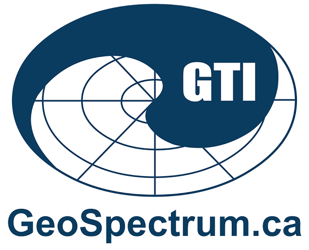

Ocean Networks Canada uses hydrophones from several manufacturers and distributors: the main ones being *Ocean Sonics* and *JASCO Applied Sciences*.

Most hydrophones are Ocean Sonics icListen smart hydrophones: icListen HF (High Frequency; 10 Hz to 200k Hz), and icListen AF (Audio Frequency; 10 Hz to 12 kHz).
JASCO provides Geospectrum-manufactured hydrophones for multi-element directional arrays, great for localizing sources.


# Model comparison

The table shows the technical specs for hydrophone models ONC uses most.

```{python}
#| echo: false
#| warning: false
import pandas as pd
import warnings
warnings.filterwarnings('ignore')

df_raw = pd.read_excel('../docs/ONC Hydrophones Specs.xlsx')
df_raw = df_raw.fillna("--")

clean_columns = []
for i, col in enumerate(df_raw.columns):
    name = str(col)
    if "Unnamed" in name:
        clean_columns.append(f"Field_{i}")
    else:
        clean_columns.append(name)

df_raw.columns = clean_columns

keep = [
    df_raw.columns[0],
    "JASCO",
    "JASCO.1",
    "Ocean Sonics",
    "Ocean Sonics.1",
    "Ocean Sonics.2",
]
df_raw = df_raw[[c for c in keep if c in df_raw.columns]]
ojs_define(specs_data = df_raw.to_dict(orient='records'))
```

```{ojs}
//| echo: false

all_cols = specs_data.length > 0 ? Object.keys(specs_data[0]) : []
label_col = all_cols[0] || ""
model_cols = all_cols.slice(1)
deviceRow = specs_data[0] || {}
specRows = specs_data.slice(1).filter(row => row[label_col] && row[label_col] !== "--")

html`
<div class="specs-table-wrap">
  <table class="specs-table">
    <thead>
      <tr>
        <th>Specification</th>
        ${model_cols.map(m => {
          const deviceName = deviceRow[m] && deviceRow[m] !== "--" ? deviceRow[m] : m.split(".")[0];
          const brand = m.split(".")[0];
          return html`<th><span class="spec-device">${deviceName}</span><span class="spec-brand">${brand}</span></th>`;
        })}
      </tr>
    </thead>
    <tbody>
      ${specRows.map(row => html`
        <tr>
          <td>${row[label_col]}</td>
          ${model_cols.map(m => {
            const val = row[m];
            return html`<td class="${val === "--" ? "spec-empty" : ""}">${val}</td>`;
          })}
        </tr>
      `)}
    </tbody>
  </table>
</div>
`
```


# Vendors

::: {.vendor-grid}

::: {.vendor}
[{lightbox=false}](https://www.jasco.com/)

### JASCO Applied Sciences {.unlisted .unnumbered}
A scientific consulting firm and equipment supplier specializing in underwater acoustics.
Founded by Joseph Arnold Scrimger in Victoria, British Columbia, in 1981, the company now has its largest primary operations office in Halifax, Nova Scotia, Canada.

JASCO operates globally across national defence, marine environmental stewardship, oil and gas asset monitoring, and academic research.
They also perform acoustic modelling, field data collection, and advanced analysis suites.

Their *Autonomous Multichannel Acoustic Recorder (AMAR)* provides passive acoustic data acquisition with high bandwidth and low noise.

Their hydrophones are manufactured by GeoSpectrum Technologies Inc.
:::

::: {.vendor}
[{lightbox=false}](https://www.geospectrum.ca/)

### GeoSpectrum Technologies Inc. (GTI) {.unlisted .unnumbered}
A specialized Canadian aerospace and defence company, based in Halifax, NS, that focuses on the design, engineering, and manufacturing of underwater acoustic transducers and specialized systems.
GeoSpectrum hydrophones are high-performance, and frequently deployed as part of hydrophone arrays managed by JASCO.
:::

::: {.vendor}
[{lightbox=false}](https://oceansonicsinc.com/)

### Ocean Sonics {.unlisted .unnumbered}
Ocean Sonics is a canadian, Nova Scotia-based pioneer in the development of smart digital hydrophones, found in 2005.
They have developed both low-frequency (icListenLF/AF) and high-frequency (icListenHF) hydrophones.
:::

::: {.vendor}
[{lightbox=false}](https://www.wildlifeacoustics.com/)

### Wildlife Acoustics {.unlisted .unnumbered}
A US-based private company based in Maynar, MA specialized provider of bioacoustics monitoring technology founded in 2003 by Ian Agranat.
Their primary focus is on designing autonomous underwater recorders and sound analysis software for ecosystem biodiversity monitoring, environmental assessments, and wildlife presence/absence surveys.

Their hydrophone Song Meter SM2M, released in 2011, is designed for long-term autonomous deployments.
:::

:::
