*For deeper dive into the physics of sound, visit [DOSITS: Science of Sound](https://dosits.org/science/sound/what-is-sound/).*

In the ocean, light attenuates within tens of metres, while sound can travel thousands of kilometres. That is why marine mammals and underwater systems use sound as their primary sense for communication and navigation.

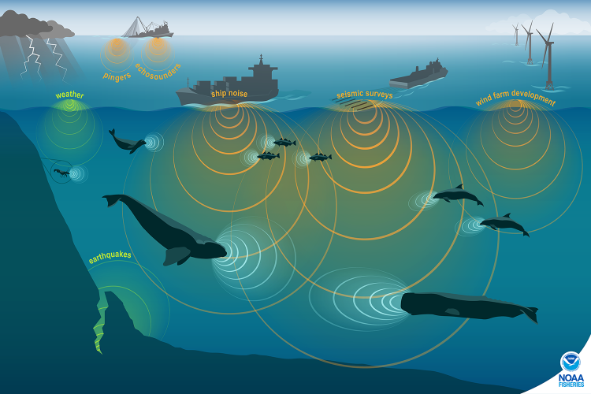

# What is sound?

Sound is created by a vibrating object. Compression and expansion produce a pressure difference, which launches a **longitudinal** wave: particle motion is parallel to the direction of travel. Underwater, that motion is a small back-and-forth of water molecules; the tighter the molecular bonds, the faster the energy is passed along. A sound wave is omnidirectional: it spreads in all directions.

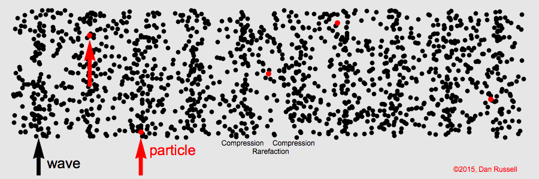

Measurable properties:

* **Amplitude and intensity (loudness)**: how much the water particles move, and how much energy crosses a unit area per time. Relative intensity is expressed in decibels (dB).
* **Frequency $f$ (pitch)**: oscillations per second, in hertz (Hz). Larger sources (baleen whales, ships) tend to produce lower frequencies; smaller sources produce higher frequencies.
* **Wavelength $\lambda$**: $c = f\lambda$, where $c$ is the speed of sound.
* **Phase $\phi$**: the timing of the wave. It is not heard, but arrays use phase (time delay) to find direction.

$$
p(t) = A \sin{(2\pi f t + \phi)}
$$

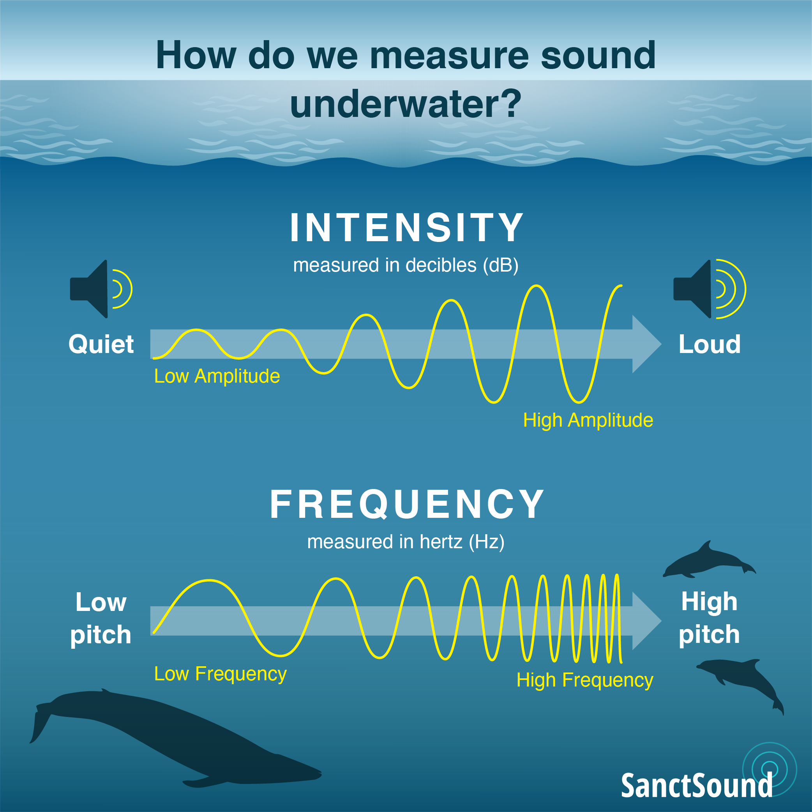{width=80%}

## Why sound is faster in water than in air

Sound travels about **4.3 times faster** in water than in air ($\approx 1500$ m/s vs $340$ m/s). Speed is set by bulk modulus $B$ (stiffness) and density $\rho$:

::: {.aside}
**Bulk modulus**: resistance to compression, $B=\rho \,\partial P / \partial \rho$.
:::

$$
v = \sqrt{B/\rho}
$$

Water is about 800 times denser than air, but about 20,000 times *less* compressible. That stiffness wins: energy transfers more efficiently between molecules, so sound is faster underwater.

# Sound speed profile

Sound speed is not constant. It varies with temperature, salinity, and pressure (depth):

* Temperature: $\Delta T$ of 1 °C $\approx$ 4 m/s
* Salinity: $\Delta S$ of 1 psu $\approx$ 1 m/s
* Depth: $\Delta z$ of 1 km $\approx$ 17 m/s

The resulting curve of $c$ versus depth is the **sound speed profile**. Off British Columbia, a typical Northeast Pacific profile has a seasonal surface layer, a sound-speed minimum at depth, then an increase with pressure:

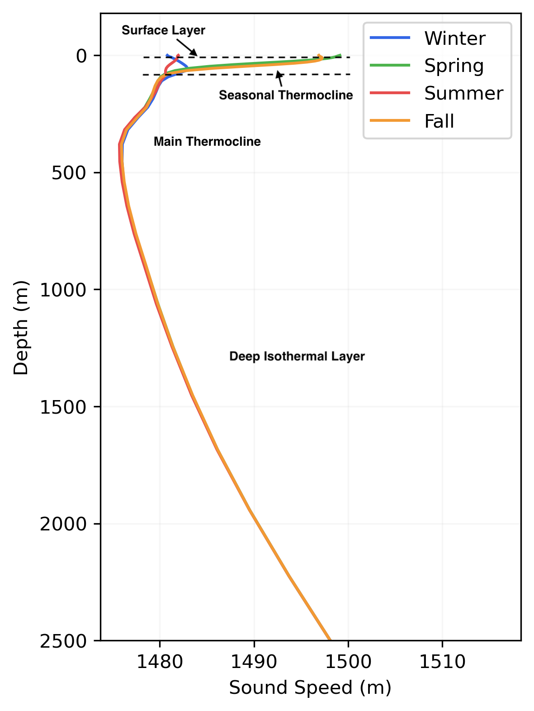{width=80%}

In general:

* Near the surface, temperature changes quickly with depth, so sound speed often *decreases* downward through the seasonal thermocline.
* At depth, temperature is nearly constant and pressure dominates, so sound speed *increases*.
* Salinity usually matters less, except in estuaries.

Surface swells also create pressure fluctuations that decay with depth. At exposed sites such as **Folger Passage**, hydrophones are moored well below 20 m so swell does not saturate the sensor.

# Waveguides

## SOFAR channel

Around 1000 m in the deep ocean, the decrease of temperature and the increase of pressure produce a **minimum** in sound speed: the SOFAR channel (SOund Fixing And Ranging). Sound always bends toward slower speed (**refraction**; [Snell's law](15-useful-equations.qmd#snells-law)). Rays that leave this layer upward or downward are refracted back into it, so energy is trapped and can travel basin-scale distances.

::: {.aside}
**SOFAR channel**: the depth of minimum sound speed, typically near 1000 m in mid-latitudes.
:::

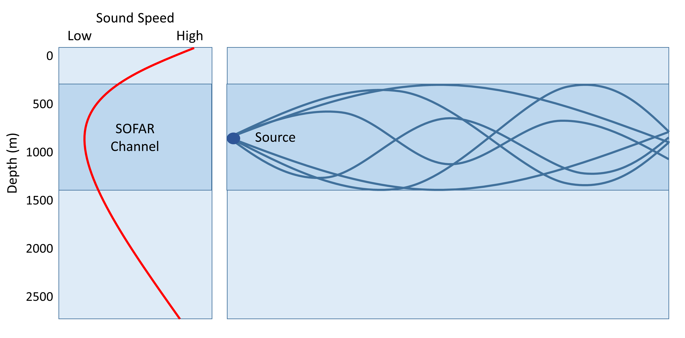

Low-frequency whale calls use this channel for long-range communication. In WWII it was used to locate downed aviators from small explosions set off in the channel.

## Surface duct

A **surface duct** traps sound in the mixed layer, typically the upper tens of metres. When sound speed *increases* with depth just below the surface, rays refract upward, reflect from the sea surface, and stay in that shallow layer (the opposite geometry of SOFAR). Ducts are common in wind-mixed coastal waters and fade when the surface warms and stratifies.

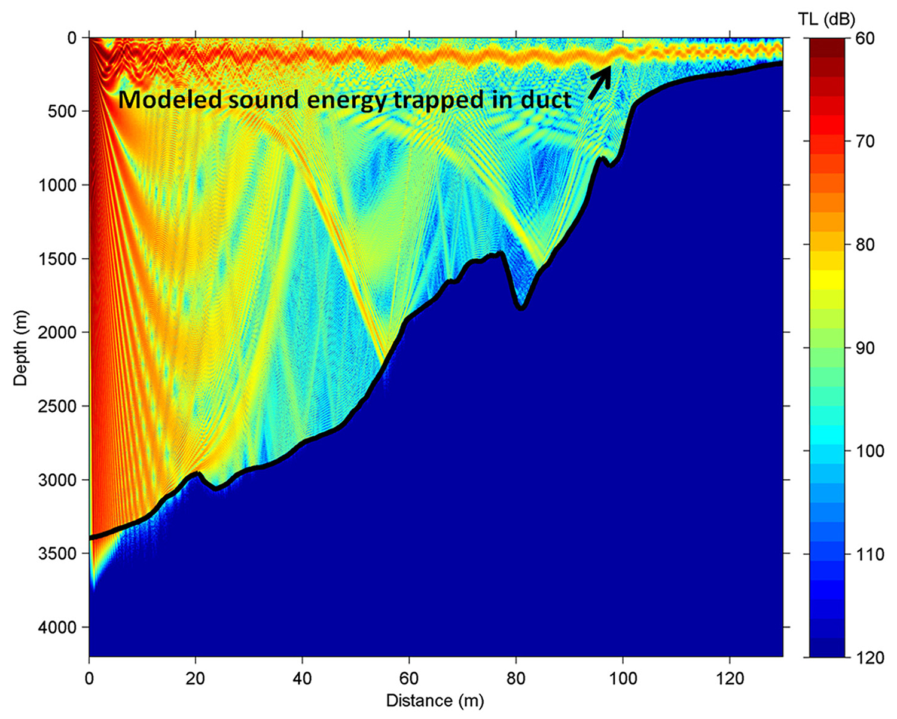

# How sound travels

A ray almost never goes in a straight line. The sound-speed profile refracts it; the sea surface and seafloor reflect it; the result can be echoes, multipath, and **shadow zones** where little energy arrives.

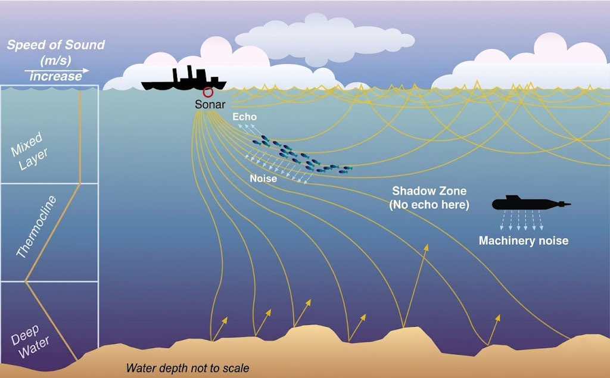

The processes that change sound travel path and sound level:

| Process | What happens | Why it matters for hydrophones |
|---------|--------------|--------------------------------|
| **Absorption / attenuation** | Molecular friction converts acoustic energy to heat; intensity also falls as the wavefront spreads ($\sim 1/r^2$ in open water). High frequencies are absorbed much faster than low frequencies. | Dolphin clicks vanish nearby; whale calls and ship rumble can cross a basin. |
| **Reflection** | Energy bounces from the sea surface or seafloor. Hard bedrock reflects better than watery sand. | Echoes and extra arrivals on the same hydrophone. |
| **Refraction** | The ray bends toward slower sound speed as $T$, $S$, or pressure change ([Snell's law](15-useful-equations.qmd#snells-law)). | SOFAR and surface ducts; shadow zones. |
| **Scattering** | A rough boundary or a cluttered medium (bubbles, ice, fish, sediment) sends energy in many directions. | Rapid loss of coherent signal; strong under sea ice. |
| **Interference** | Multipath arrivals overlap. Peaks aligning are louder (constructive); peak meeting trough can cancel (destructive). | Tonal lines, fading, and “holes” in a spectrogram that are not instrument faults. |
| **Diffraction** | Energy bends around an obstacle (seamount, ridge) into the geometric shadow. | Some signal still reaches a hydrophone “behind” bathymetry. |
| **Reverberation** | Scattered sound that lingers after the source stops. Strongest in shallow water. | Raises the noise floor and can mask a target. |

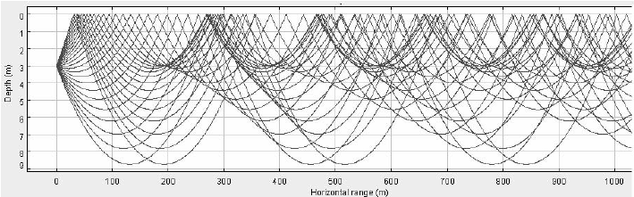{width=70%}

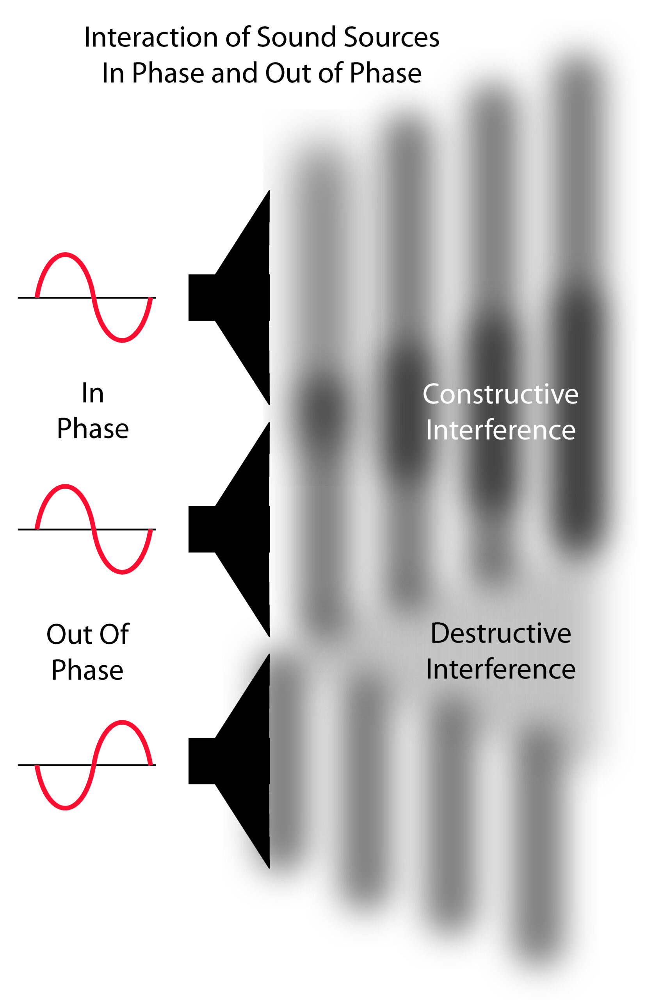{width=40%}

# Transmission loss

From a source (a whale) to a receiver (a hydrophone), level drops. That drop is **transmission loss (TL)**, also called propagation loss:

$$
RL = SL - TL
$$

**RL** is received level at the hydrophone; **SL** is source level. TL splits into geometric spreading (GS) and everything else (excess attenuation, EA):

$$
TL = GS + EA
$$

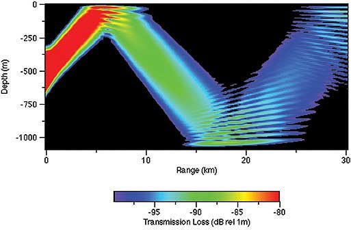

**Geometric spreading** does not depend on frequency, only on geometry:

* Deep, open water (spherical): $GS = 20 \log_{10} (r)$
* Shallow water and surface ducts (cylindrical): $GS = 10 \log_{10} (r)$

**Excess attenuation** is the rest: absorption ($\alpha r$), reflection and scattering at boundaries (including sea ice), and diffraction around bathymetry.

$$
EA = \text{Loss}_{\text{absorption}} + \text{Loss}_{\text{reflection}} + \text{Loss}_{\text{scattering}} + \text{Loss}_{\text{diffraction}}
$$

# Arctic sound (Cambridge Bay)

ONC’s Arctic hydrophone at **Cambridge Bay** sits in a very different waveguide from the Northeast Pacific. Polar temperatures change little with depth, so the sound-speed minimum is often at the surface.

* **Winter**: sound speed increases with depth, so rays refract *upward* into the ice. Rough ice scatters energy; historically this limited long-range propagation to frequencies below about 30 Hz.
* **Summer**: surface warming can shift the minimum to a sub-surface duct around 150 m, isolating sound from the ice and letting higher frequencies travel farther.

Under global warming, sea ice declines, that winter scattering has weakened and higher frequencies can now propagate farther than they used to, which also means more underwater noise (including vessels) reaching the hydrophone.

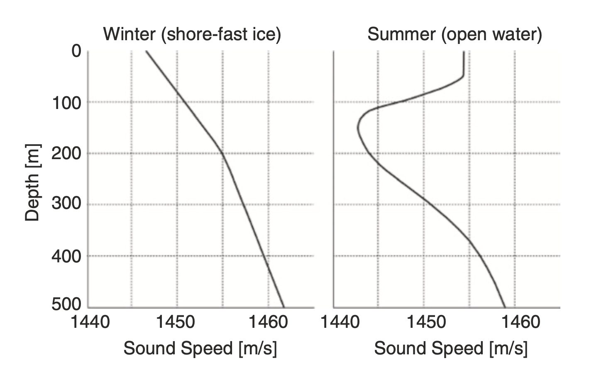{width=80%}

Further reading: Cook, Barclay & Richards, *Ambient Noise in the Canadian Arctic*, pp. 105–133.

# Acoustic masking

Loud anthropogenic (human-made) activities can severely affect marine mammals by completely masking or interfering with the sounds they use for communication, navigation, mating, and feeding.
If the sound is loud enough, it makes the marine species' sounds undetectable to others.
Such sounds include shipping traffic, sonar, construction, airguns used to detect oil and gas below the sea floor, and military exercises.

Sound masking has led to impacting:

* physical health: some sounds can be so loud that they can destroy hearing sensitivity temporarily, and in extreme cases permanently damaging hearing.
* behavior: marine mammals can get lost, and reduce or no longer mate. 

This is the scientific motivation behind programs such as [ECHO](https://www.portvancouver.com/environment/healthy-ecosystem/echo) in the Strait of Georgia: reducing ship noise so whale signals remain usable.

# Sound propagation modelling

Ray tracing is used at ONC to locate sources, estimate detection range, plan new sites, and avoid “deaf zones.” The underlying [wave equation](15-useful-equations.qmd#wave-equation) is in Useful Equations.

**BELLHOP** (Michael B. Porter) is one of the many sound propagation models that traces beams at a chosen frequency. It needs bathymetry along the path, a sound-speed profile (from $T$, $S$, $p$), and a bottom type (e.g. clay). The output is the transmission loss along a path.

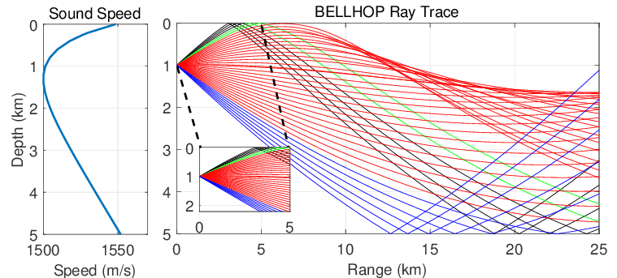

# References

* Urick, *Principles of Underwater Acoustics*
* Hodges, *Underwater Acoustics*
* Medwin and Clay
* NOAA: [Ocean Noise](https://www.fisheries.noaa.gov/national/science-data/ocean-noise)
* Discovery of Sound in the Sea: [Science of Sound](https://dosits.org/science/sound/what-is-sound/)
* Cook, Barclay & Richards, *Ambient Noise in the Canadian Arctic*, pp. 105–133
