Explore acoustic signatures captured across our monitoring stations.
Examples shown here include marine mammals, interference from nearby instruments, and weather events.
Click a spectrogram to enlarge it.

Go to [ONC's SoundCloud page](https://soundcloud.com/oceannetworkscanada) for more sounds from the hydrophone data, and [Voices in the Sea](https://voicesinthesea.ucsd.edu/index.html) for additional examples.


# Interference from nearby instruments

::: {.dp-panel .sound-example}

::: {.dp-split}

::: {.dp-visual}
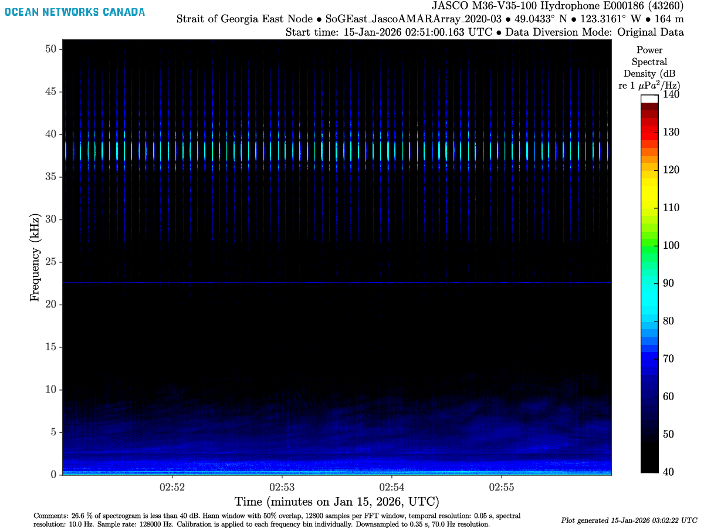{lightbox=true group="sound-examples"}
:::

::: {.dp-copy}

```{=html}
<div class="dp-meta">
  <span class="dp-pill"><span class="dp-pill-k">Location</span> Strait of Georgia East, BC</span>
  <span class="dp-pill"><span class="dp-pill-k">Sounds</span> Tonal, Interference</span>
</div>
```

An ADCP is located very close to the hydrophone, resulting in a strong signal between 35 and 40 kHz. A tonal line is seen around 22 kHz.

:::

:::

:::


# SONAR

::: {.dp-panel .sound-example}

::: {.dp-split}

::: {.dp-visual}
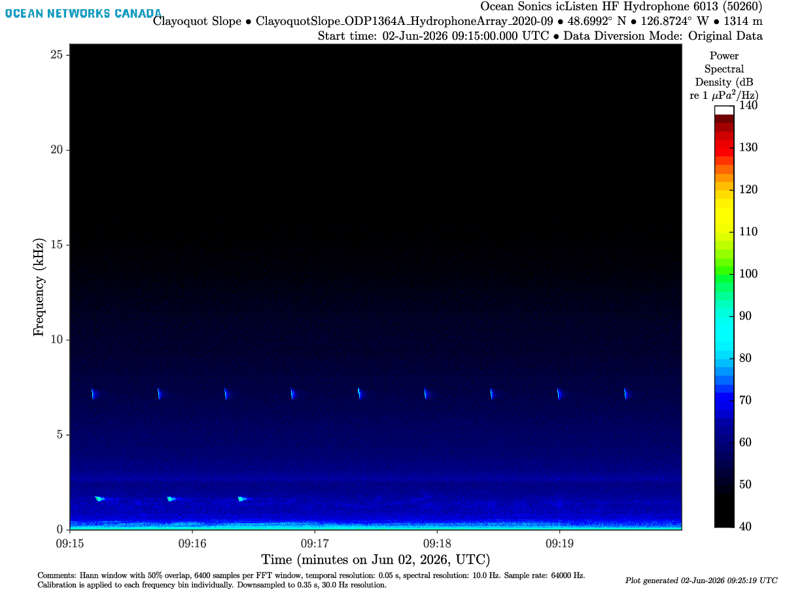{lightbox=true group="sound-examples"}
:::

::: {.dp-copy}

```{=html}
<div class="dp-meta">
  <span class="dp-pill"><span class="dp-pill-k">Location</span> Clayoquot Slope, BC</span>
  <span class="dp-pill"><span class="dp-pill-k">Sounds</span> SONAR at 2 kHz and 7 kHz</span>
</div>
```

SONARs are used to measure distances, help navigate or detect objects by sending a sound wave into the water.
Two SONARs signals here at 2 and 7 kHz are potentially coming from a nearby NAVY ship, and could be from different sources.

:::

:::

:::


# Airplane

::: {.dp-panel .sound-example}

::: {.dp-split}

::: {.dp-visual}
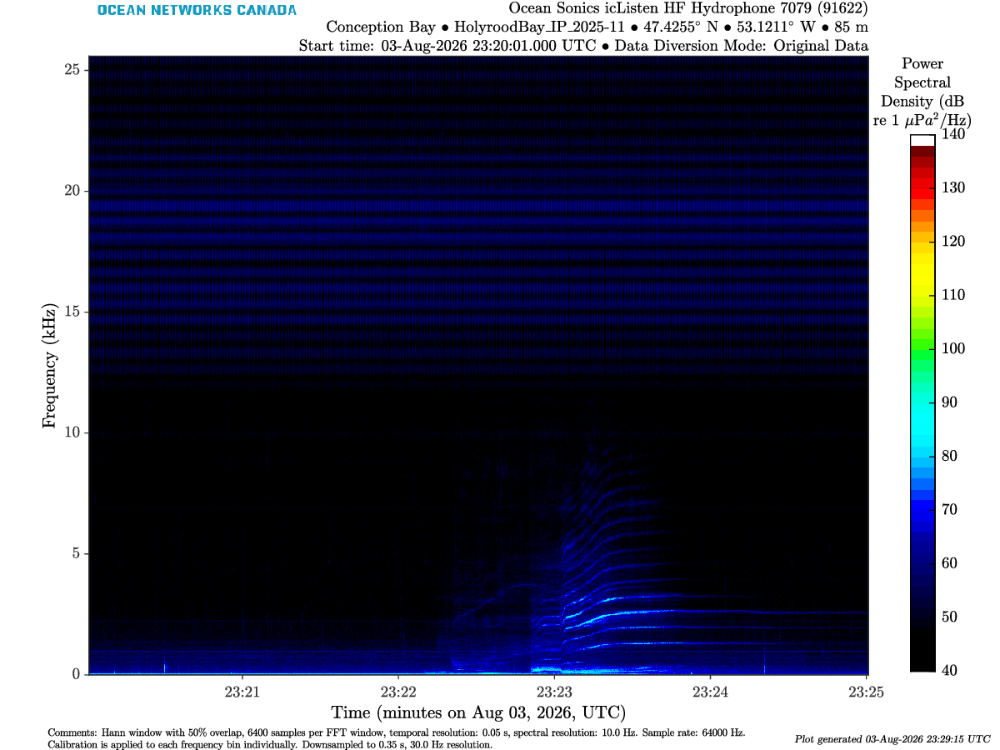{lightbox=true group="sound-examples"}
:::

::: {.dp-copy}

```{=html}
<div class="dp-meta">
  <span class="dp-pill"><span class="dp-pill-k">Location</span> Cambridge Bay, NU</span>
  <span class="dp-pill"><span class="dp-pill-k">Sounds</span> Airplane flying over</span>
</div>
```

:::

:::

:::


# Tonals

::: {.dp-panel .sound-example}

::: {.dp-split}

::: {.dp-visual}
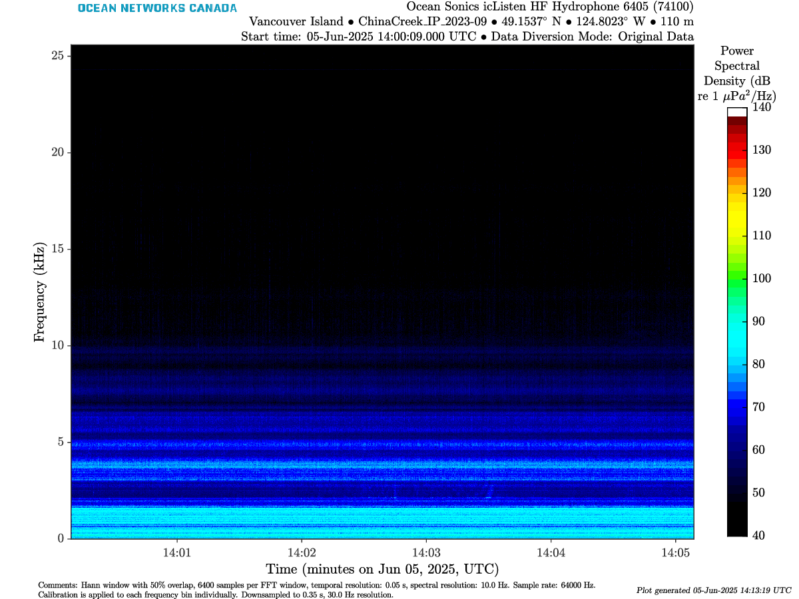{lightbox=true group="sound-examples"}
:::

::: {.dp-copy}

```{=html}
<div class="dp-meta">
  <span class="dp-pill"><span class="dp-pill-k">Location</span> China Creek, BC</span>
  <span class="dp-pill"><span class="dp-pill-k">Sounds</span> Tonal</span>
</div>
```

A stationary signal at a single frequency that often results from nearby instruments, ship propellers from vessels on standby, or land-based mechanical sources when the hydrophone is shallow enough.

:::

:::

:::


# Whales

::: {.dp-panel .sound-example}

::: {.dp-split}

::: {.dp-visual}
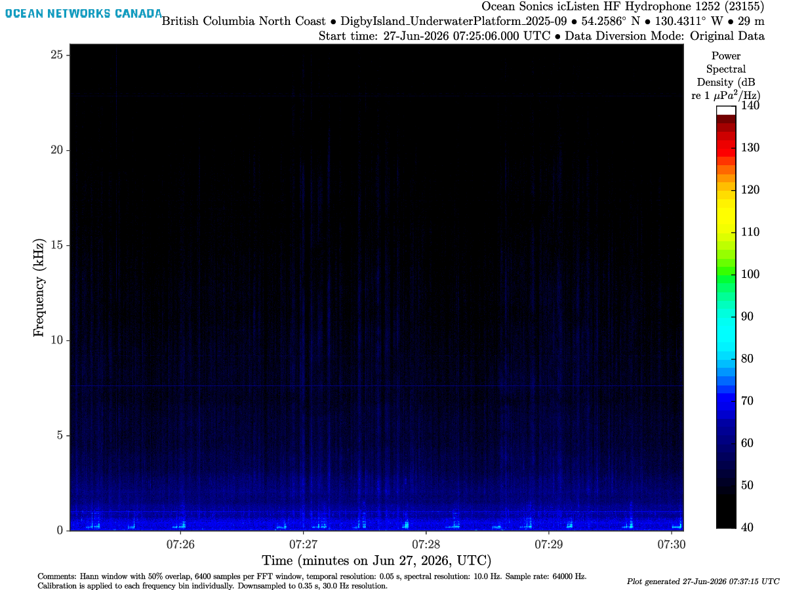{lightbox=true group="sound-examples"}
:::

::: {.dp-copy}

```{=html}
<div class="dp-meta">
  <span class="dp-pill"><span class="dp-pill-k">Location</span> Digby Island, BC</span>
  <span class="dp-pill"><span class="dp-pill-k">Sounds</span> Whales, Tonal</span>
</div>
```

Different whales vocalize at different frequencies with distinct patterns. In this example, whale vocalizations are seen below 1 kHz. A tonal at 8 kHz is also present.

:::

:::

:::


# Snowmobile

::: {.dp-panel .sound-example}

::: {.dp-split}

::: {.dp-visual}
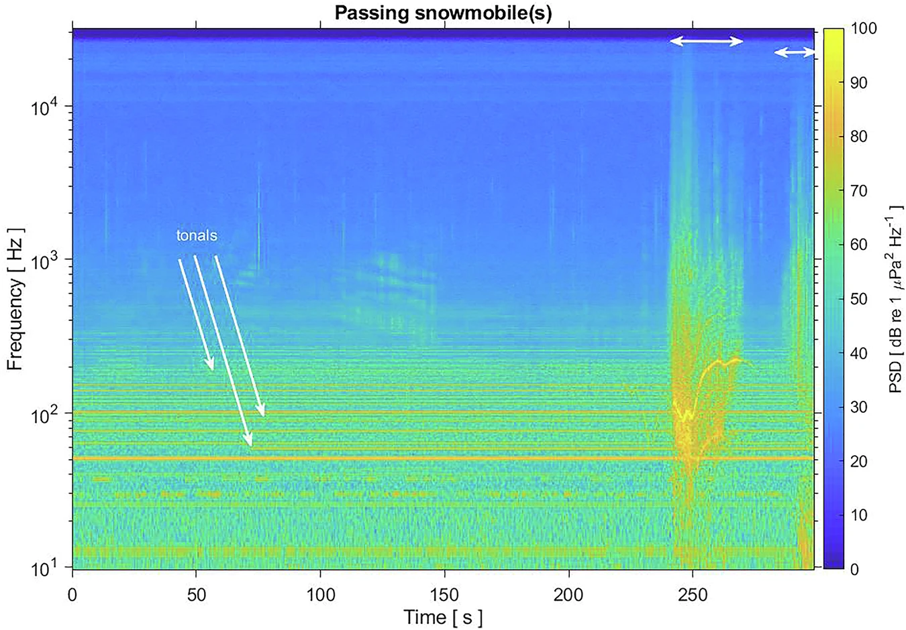{lightbox=true group="sound-examples"}
:::

::: {.dp-copy}

```{=html}
<div class="dp-meta">
  <span class="dp-pill"><span class="dp-pill-k">Location</span> Cambridge Bay, NU</span>
  <span class="dp-pill"><span class="dp-pill-k">Sounds</span> Snowmobile transit, Tonals</span>
</div>
```

The soundscape is dominated by surface-coupled noise. In winter, snowmobiles create distinct harmonic bands ($10^2$ to $10^3$ Hz). These overlap with ringed seal vocalizations, creating a high risk of **acoustic masking** in shallow ice-covered leads.

[Marine soundscapes of the Arctic and human impacts: going beyond the "shipping bands"](https://www.nature.com/articles/s44384-025-00038-1)

:::

:::

:::


# Helicopter

::: {.dp-panel .sound-example}

::: {.dp-split}

::: {.dp-visual}
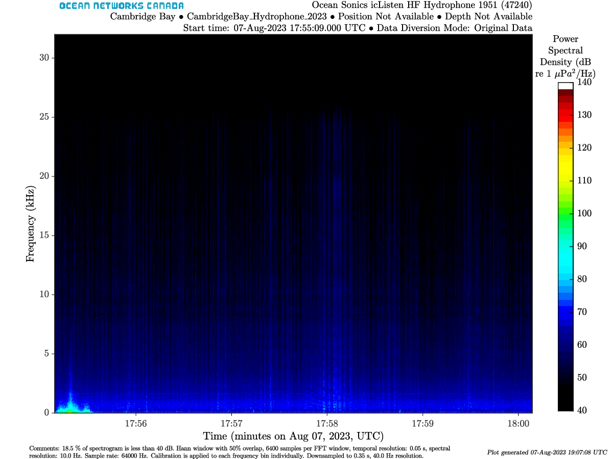{lightbox=true group="sound-examples"}
:::

::: {.dp-copy}

```{=html}
<div class="dp-meta">
  <span class="dp-pill"><span class="dp-pill-k">Location</span> Cambridge Bay, NU</span>
  <span class="dp-pill"><span class="dp-pill-k">Sounds</span> Helicopter transit</span>
</div>
```

The hydrophone in Cambridge Bay is shallow enough (10 m deep) that it can detect helicopters flying above the surface [17:55:00 - 17:55:30].

:::

:::

:::


# Earthquake at Endeavour

::: {.dp-panel .sound-example}

::: {.dp-split}

::: {.dp-visual}
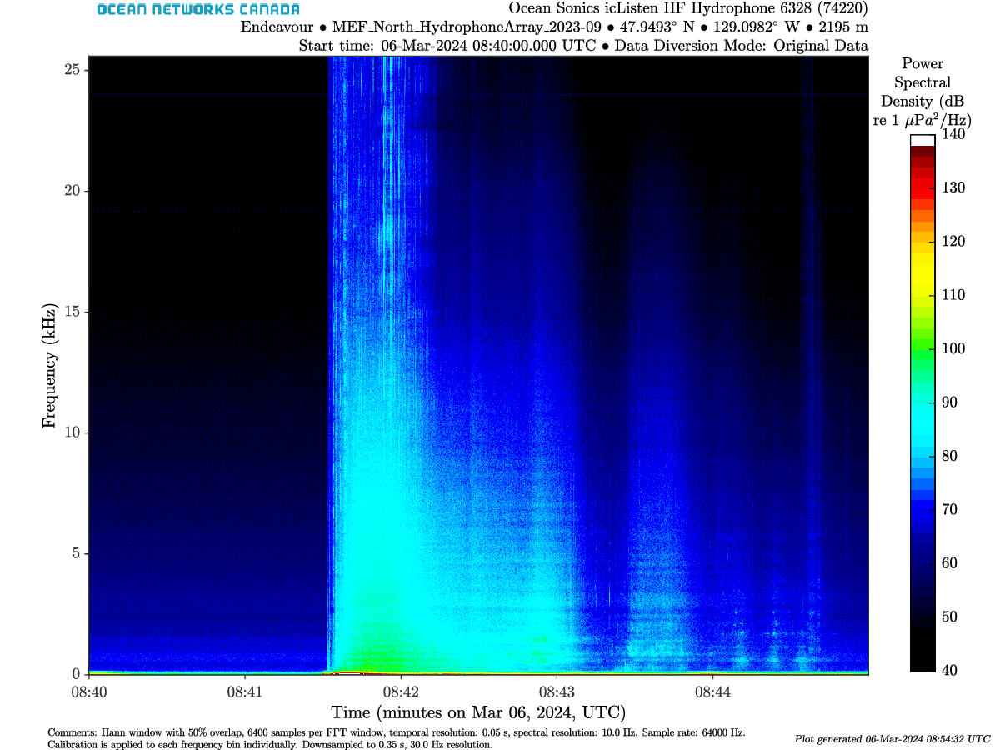{lightbox=true group="sound-examples"}
:::

::: {.dp-copy}

```{=html}
<div class="dp-meta">
  <span class="dp-pill"><span class="dp-pill-k">Location</span> Endeavour, Pacific Ocean</span>
  <span class="dp-pill"><span class="dp-pill-k">Sounds</span> Earthquake</span>
</div>
```

Earthquake sounds are mostly detectable at low frequency. Find more information about this event in this [ONC story](https://www.oceannetworks.ca/news-and-stories/stories/endeavour-site-records-the-highest-level-of-earthquake-activity-in-20-years/).

:::

:::

:::


# Pump contamination

::: {.dp-panel .sound-example}

::: {.dp-split}

::: {.dp-visual}
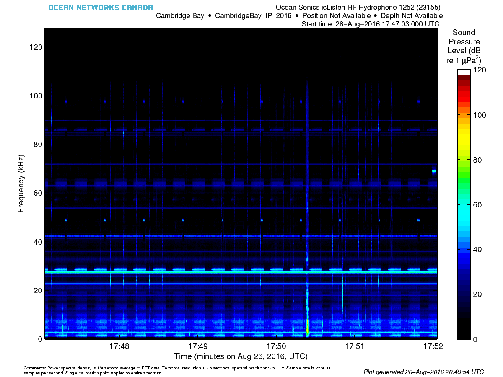{lightbox=true group="sound-examples"}
:::

::: {.dp-copy}

```{=html}
<div class="dp-meta">
  <span class="dp-pill"><span class="dp-pill-k">Location</span> Cambridge Bay, NU</span>
  <span class="dp-pill"><span class="dp-pill-k">Sounds</span> Pump</span>
</div>
```

At that time, the hydrophone was too close to a platform with other noisy instruments which included a pump.

:::

:::

:::

::: {.listen-section}
### Listen to the ocean soundscape

::: {.grid .sound-card-grid}

::: {.g-col-12 .g-col-md-6}
::: {.sound-card}
::: {.sound-card-visual}
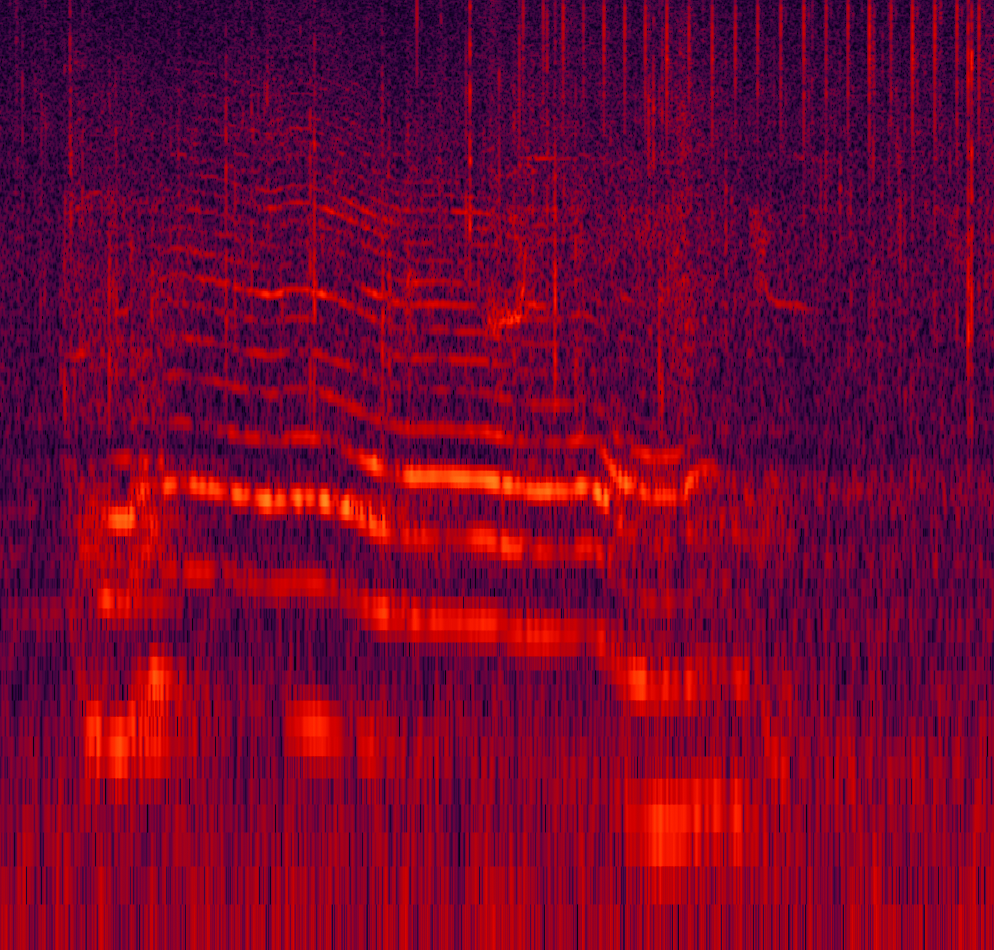{lightbox=true group="intro-sounds" fig-alt="Spectrogram of a killer whale call." width="100%"}
:::
<p class="sound-card-title">Killer whale</p>
<p class="sound-card-caption">Calls and echolocation</p>
```{=html}
<audio class="listen-audio" controls preload="metadata">
  <source src="../sounds/ICLISTENHF6325_20260712T020000.000Z_normalized.flac" type="audio/flac">
  Your browser does not support the audio player.
</audio>
```
:::
:::

::: {.g-col-12 .g-col-md-6}
::: {.sound-card}
::: {.sound-card-visual}
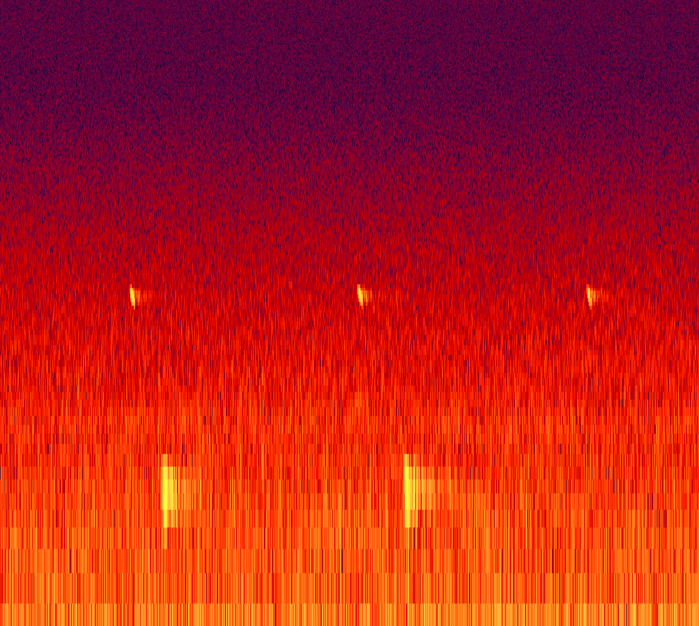{lightbox=true group="intro-sounds" fig-alt="Spectrogram of sonar pings." width="100%"}
:::
<p class="sound-card-title">SONAR</p>
<p class="sound-card-caption">Active pings</p>
```{=html}
<audio class="listen-audio" controls preload="metadata">
  <source src="../sounds/ICLISTENHF6016_20260602T091500.000Z_normalized.flac" type="audio/flac">
  Your browser does not support the audio player.
</audio>
```
:::
:::

:::

More recordings are on [ONC's SoundCloud](https://soundcloud.com/oceannetworkscanada).
:::


# Resources

```{=html}
<div class="docs-card">
  <div class="docs-card-title">
    
    <span>Confluence Documentation</span>
  </div>
  <ul class="docs-card-list">
    <li><a href="https://internal.oceannetworks.ca/spaces/ONCData/pages/13648503/Hydrophone+daily+checks">Hydrophone Daily Checks</a></li>
  </ul>
</div>
```
