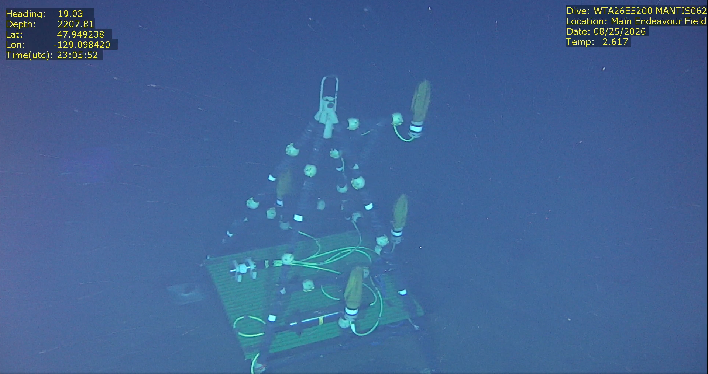
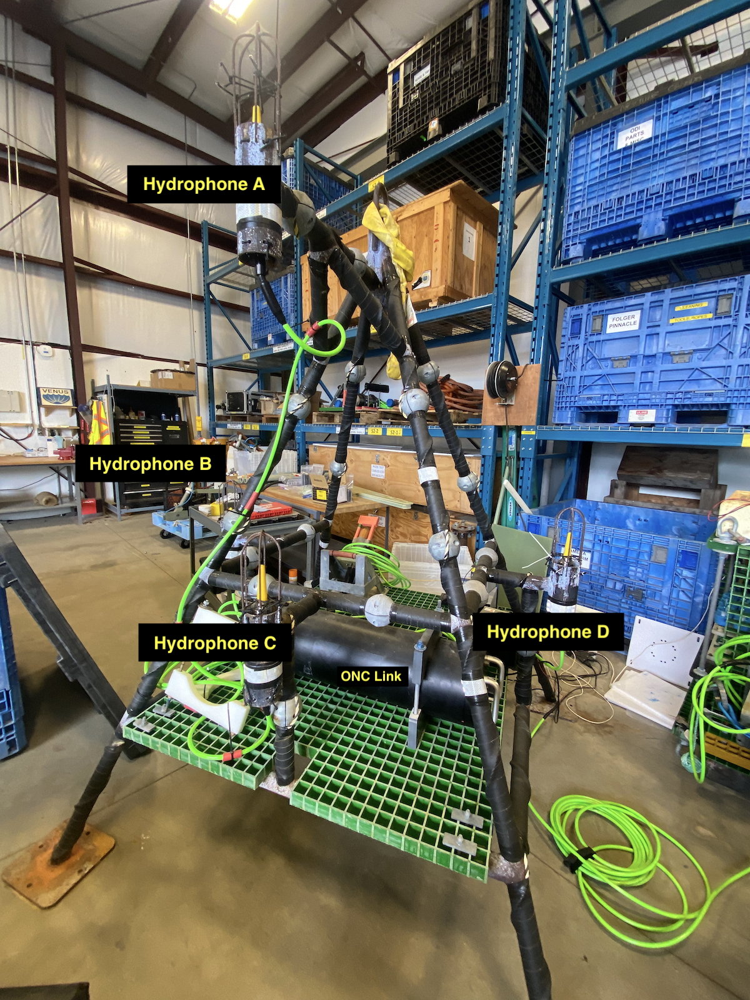
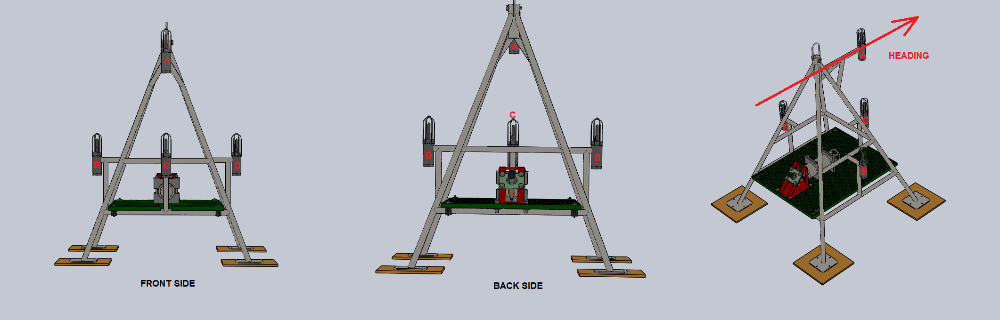
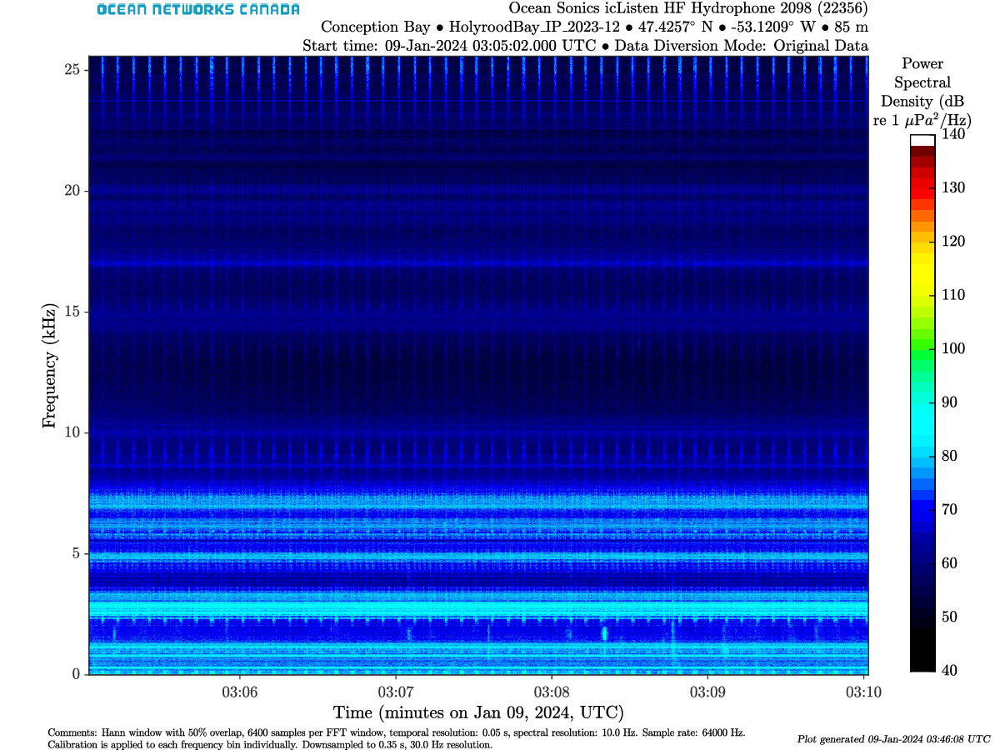
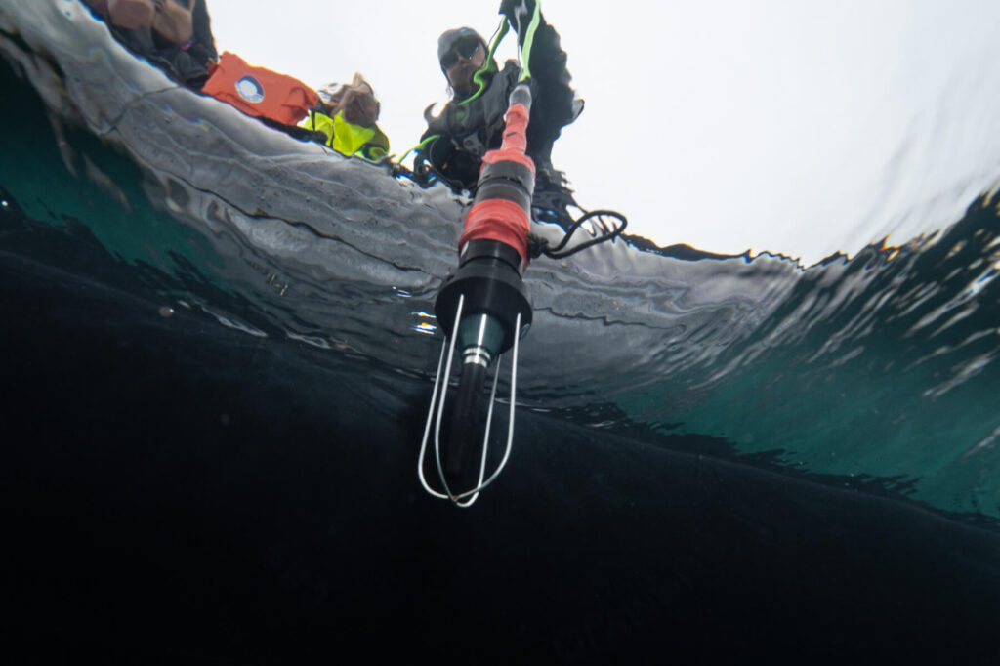
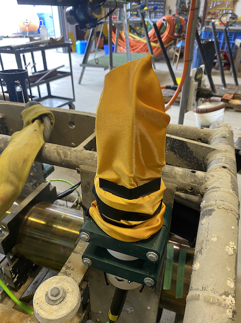

At Ocean Networks Canada, passive acoustic infrastructure falls into two deployment configurations:

* **Single Hydrophone Nodes:** Simpler and least expensive method for long-term soundscape monitoring
* **Synchronized Multi-Element Arrays:** Structure mounting 2 to 4 *synchronized* hydrophones to estimate sound direction or even perform sound localization

::: {.fig-full}
{lightbox=true}
:::

# Challenges

The ultimate goal for acoustics data collection is to capture high-quality soundscape while reducing unwanted noise (high Signal to Noise ratio).
Noise can originate from nearby instruments, cable vibration, debris hitting the sensor, or even strong ocean currents.

While it is no small feat (or rather impossible) to eliminate noise entirely, careful infrastructure design, engineering, and testing can drastically improve data quality.
In addition, we always want to minimize the risk of damage to the instrument.
This section touches on all these elements.


# Geometry and mounting

ONC deploys hydrophones in two ways.

**Cabled arrays** sit on the observatory. Two or four hydrophones are mounted on a frame and wired to an **ONC Link** (ONC’s version of Ocean Sonics’ icLink).
The Link time-synchronizes the channels and combines their data streams.
The ONC Link is connected to a **Junction Box (JB)** which itself receives power from the seafloor cable.
The advantage of cabled sites is that the data comes in in near real time.

**Autonomous arrays** are not cabled, they run on batteries and record onboard until recovery.
The JASCO AMAR hydrophones in the Strait of Georgia East are a good example of this.
Unfortunately, the data is only available once the hydrophones have been recovered, so there is no way to know in real time if there is an issue with the hydrophones until then.
Moreover, if the memory is full, the hydrophone stops recording and we are effectively losing new data.

In both cases the hydrophones share a structure with other instruments. Those neighbours radiate noise, so each piece of hardware should be tested for level and frequency before it sits next to a hydrophone.

The image below shows a **box-type** hydrophone array, mounted at the MTC (Marine Technology Centre).
On this array, there are four hydrophones at locations A, B, C, D, distanced about 1-metre from one another.

{lightbox=true}

The distance between hydrophones is chosen for **beamforming**: estimating direction of arrival.
At 1 metre between the elements, it is possible to localize sounds emitted roughly between 100-750 Hz, for example Humpback Whales.
For high-frequency marine mammals (e.g., dolphin whistles, sperm whale clicks), an even smaller spacing is required (see @sec-beamforming for a more detailed explanation).

{lightbox=true}


There are many more possible configurations for hydrophones, depending on the scientific objectives of ocean monitoring (e.g., line arrays, USBL, SBL, LBL).


<!--
## Hydrophones can be deployed in several configurations: 

* **Single Hydrophone**: Baseline monitoring.
* **Line Arrays**: Arranged in a straight line for vertical profiling.
* **USBL (Ultra-Short Base Line)**: Used for precise underwater positioning.
* **SBL (Short Baseline)**: Examples include 3-element horizontal arrays, 4-element tetrahedral arrays, or 4-element box-type arrays.
* **LBL (Long Base Line)**: Used for tracking over wide areas.
-->

# Mitigating noise and instrument damage

## Interference
When adding hydrophones to a multi-instrument platform, all nearby infrastructure should ideally be evaluated for noise, although this is an arduous task and we generally know after the fact if there is interference and to what intensity.
Proximity interference will show up clearly as persistent lines or bursts in the spectrogram.

In this example from 2023, interference noise from instruments on the same platform at the Holyrood site was intense enough to fully mask natural ambient sound, biological vocalizations, and other signals of scientific interest.


{lightbox=true}

After the 2023 Holyrood recordings, ONC ran a dedicated interference investigation (Holyrood Acoustic Testing Summary, Brendan Smith) to find which platform instruments were contaminating the hydrophone. The likely sources were the ADCP, the pCO₂ sensor, and the SeaBird Microcat. That work is the template for later sites: identify the noisy neighbour, then increase separation or change the duty cycle before the next deployment.

In general, in order to prevent acoustic contamination, the following "Rules of Thumb" separation distances between the hydrophone array and the systems:

* Small Pumps (e.g., CTD pump): > 100 m
* Large Pumps: > 2 km
* Mooring chains > 5 km
* Shackles/Hardware > 500 m
* Active acoustics (e.g., ADCP) > 3 x the local water depth

Diagnosing interference before deployment: using underwater sound propagation models (e.g., BELLHOP) can help diagnose potential sources of interference.


## Infrastructure and flow noise

How a hydrophone is physically attached to the infrastructure makes a massive difference in data quality.
Things like loose parts, rigid attachments, or using the wrong ties may affect data quality and show up as interference, or completely mask the data.
Protective mounting hardwares are designed to minimize structural interference and flow noise.

Because hydrophones are pressure sensors, they are susceptible to pressure waves generated by surface swells (which decay exponentially with depth).
Wave pressure can easily saturate the hydrophone's dynamic range.
Hydrophones should generally be moored at least 20 metres deep, and significantly deeper in areas known for large swells (e.g., Folger Passage).

Here is a list of mounting material and their advantages or disadvantages:

* Shock Cord/Bungee: Excellent (decouples vibration)
* O-rings: Good (provides some dampening)
* Rubber in a plastic clamp: Poor (transfers some vibration)
* Rubber in a tight metal clamp: Bad (transfers heavy vibration)

### Hydrophone guards

Hydrophones are often protected by a cage (guard or shroud), a semi-rigid housing that surrounds the hydrophone.
The main purpose is to prevent debris, sea life, or cables from striking the sensor.
It can also help break turbulent flow (see Karman vortices) around the sensor, which can create low-frequency noise in the data.

{lightbox=true}

Those guards are *acoustically transparent*, designed so that they don't reflect the sound waves.

In high sediments areas, platform parts can become covered by sediments which leads to corrosion and wear.
Guards can prevent sediments from accumulating on the hydrophone.

## Biofouling

Biofouling is when marine life accumulates on the instrument.
This can degrade the materials or significantly reduce data quality.
In the data, it shows up as a slow decay of sensitivity over time.
While no method is absolutely foolproof to prevent biofouling, ONC has adopted the "sock-method", which has shown to be great success.

The "sock method": we use a simple *sock* (graciously made by a local seamstress), which is a soft and flexible cover that fit snug over the hydrophone shroud.
It greatly extends lifetime of all hydrophones by preventing microorganisms to directly attach on the sensor.
It can also prevent fine sediments (e.g., silt) from settling into the small gaps.

{lightbox=true}


# Sound direction & beamforming {#sec-beamforming}

A single hydrophone measures *sound level*, regardless of where the sound originated from.
To derive any spatial information (where the sound is coming from), multiple hydrophones must be deployed in a synchronized array:

* **Beamforming (Direction of Arrival)**: Uses arrival-time differences across closely-spaced hydrophones on a time-synchronized hydrophone array to calculate the bearing ($\theta$) or direction of a sound source.
* **Trilateration (Position & Range):** Uses measurements across multiple widely-separated hydrophones to calculate the spatial coordinates ($lat,lon$) of a sound.

::: {.callout-warning appearance="simple"}
**Common Misnomer:** Do not confuse **triangulation** with **trilateration**.
What people usually refer to as triangulation is actually trilateration.
Triangulation rather uses known angles to estimate distances and not to locate a specific geographical location.
:::

Sound from a given direction reaches one hydrophone slightly before the others.
That **time difference of arrival** (TDOA) and the known element spacing give the angle ($\theta$) of arrival.
In practice we apply phase shifts to each channel in the frequency domain corresponding to a given steering direction and sum the channels.

<!--
Sound from one direction reaches hydrophone A slightly before hydrophone B. That **time difference of arrival (TDOA)** and the known spacing give the angle.
In practice we delay each channel so a chosen steering direction lines up, then add the channels:

* Energy from that direction adds **coherently** (gain scales about as $N$, the number of hydrophones).
* Uncorrelated noise adds more slowly (about $1/\sqrt{N}$).
--> 

Three design rules matter:

* **Spacing vs frequency:** To avoid spatial aliasing, spacing between elements should satisfy $d \leq \lambda/2 = c/(2f)$. A **1 m** aperture sets an upper limit of **~750 Hz** for sound directionality, which is well suited for low-frequency sources like humpback whales, fin whales and earthquakes.
* **Timing:** Channel-to-channel synchronization must be *better than* one sample period. That is the job of the ONC Link (cabled) or the recorder’s common clock on autonomous devices.
* **Geometry:** A line array is directional in one plane; a box or tetrahedral array gives a 3-D arrival angle, still without range.

# Deployment

At ONC, most hydrophones are deployed using a Remotely Operated Vehicles (ROV); which is a tethered, unoccupied underwater robots used to explore, inspect, and work in too deep or dangerous ocean environments.

<!--

# Resources


```{=html}
<div style="border: 1px solid rgba(255, 255, 255, 0.2); 
            border-radius: 8px; 
            padding: 16px; 
            background: rgba(255, 255, 255, 0.05); 
            margin-top: 15px;
            backdrop-filter: blur(5px);
            color: white;">

  <div style="display: flex; align-items: center; gap: 12px; margin-bottom: 12px;">
    
    <span style="font-weight: bold; font-size: 1.1em; letter-spacing: 0.3px;">
      Confluence Documentation
    </span>
  </div>

  <ul style="list-style-type: none; padding-left: 36px; margin: 0;">
    
    <li style="margin-bottom: 10px;">
      <a href="https://internal.oceannetworks.ca/spaces/MO/pages/125083608/Four+Element+Hydrophone+Platform" 
         style="color: #82caff; text-decoration: none; font-weight: 500; border-bottom: 1px solid rgba(130, 202, 255, 0.3);">
         Four Element Hydrophone Platform
      </a>
	</li>

    <li style="margin-bottom: 10px;">
      <a href="https://internal.oceannetworks.ca/spaces/MO/pages/216205603/Presentations+and+other+documents?preview=/216205603/216205609/Hydrophone%20system%20engineering.pdf" 
         style="color: #82caff; text-decoration: none; font-weight: 500; border-bottom: 1px solid rgba(130, 202, 255, 0.3);">
         Presentation: Hydrophone Deployment Systems Engineering (Tom Dakin)
      </a>
    </li>

    <li style="margin-bottom: 10px;">
      <a href="https://wiki.oceannetworks.ca/spaces/PLATFORM/pages/81887880/Hydrophone+Arrays" 
         style="color: #82caff; text-decoration: none; font-weight: 500; border-bottom: 1px solid rgba(130, 202, 255, 0.3);">
         Hydrophone Array Positions
      </a>
    </li>

  </ul>
</div>
```


```{=html}
<div style="border: 1px solid rgba(255, 255, 255, 0.2); 
            border-radius: 8px; 
            padding: 16px; 
            background: rgba(255, 255, 255, 0.05); 
            margin-top: 15px;
            backdrop-filter: blur(5px);
            color: white;">

  <div style="display: flex; align-items: center; gap: 12px; margin-bottom: 12px;">
    
    <span style="font-weight: bold; font-size: 1.1em; letter-spacing: 0.3px;">
      External Resources
    </span>
  </div>

  <ul style="list-style-type: none; padding-left: 36px; margin: 0;">
    <li style="margin-bottom: 10px;">
      <a href="https://tc.canada.ca/sites/default/files/2024-03/towards_standard_vessel_urn_measurement_shallow_water-final.pdf" 
         style="color: #82caff; text-decoration: none; font-weight: 500; border-bottom: 1px solid rgba(130, 202, 255, 0.3);">
         JASCO Report (2022): Towards a Standard for Vessel URN Measurement in Shallow Water
      </a>
    </li>

  </ul>
</div>
```

-->