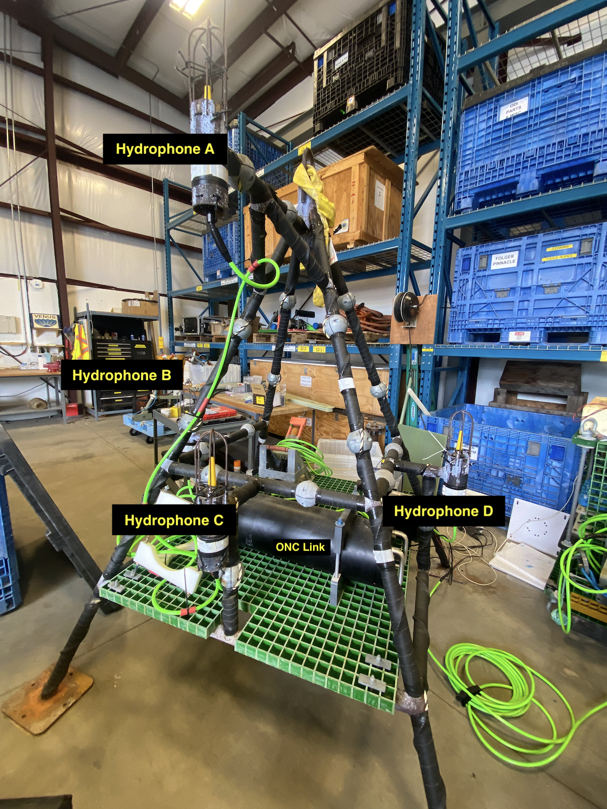
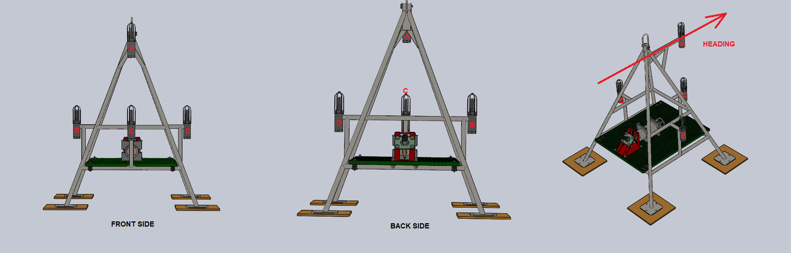
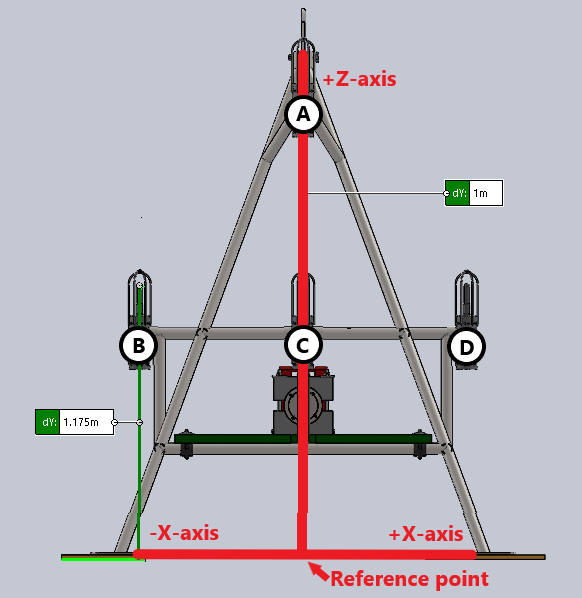
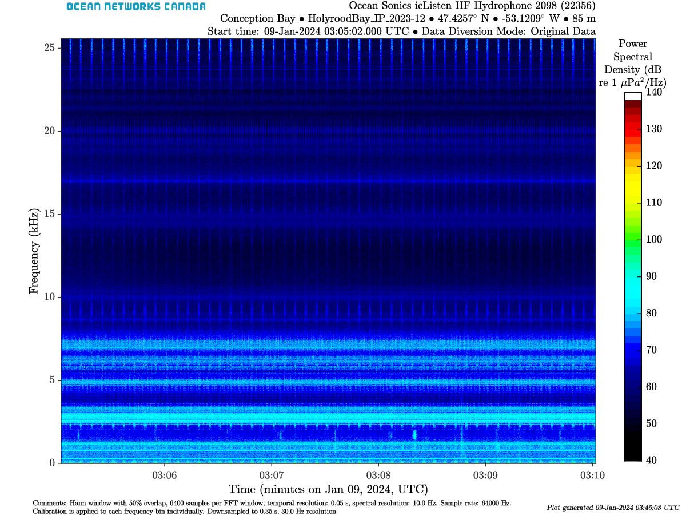
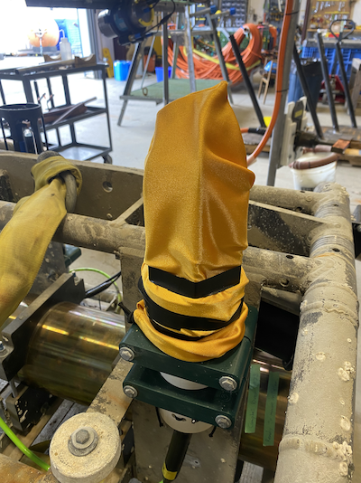

::: {.callout-important appearance="simple" style="color: #d32f2f; border-left-color: #d32f2f; background-color: #ffebee;"}
## Improvements for this page
* include a diagram of platform/array including OIM, JB, SIIM, SCU
* complete holyrood interference paragraph + link report
* add shroud photo
* deployment section
:::

When mounting hydrophones, the scientific goals of ocean monitoring will dictate how the infrasctructure is built.
There exists several ways that hydrophones can be arranged depending on the application.
For example, while a single hydrophone can capture sound, several hydrophones together can provide direction, range, and help with separation of overlapping noises. 

At Ocean Networks Canada, we use two types of arrays:

* Single Hydrophone
* Hydrophone Array

# Challenges

The ultimate goal for acoustics data collection is to capture high-quality soundscape while reducing unwanted noise (high Signal to Noise ratio).
Noise can originate from nearby instruments, cable vibration, debris hitting the sensor, or even strong ocean currents.

While it is no small feat (or rather impossible) to eliminate noise entirely, careful infrastructure design, engineering, and testing can drastically improve data quality.
In addition, we always want to minimize the risk of damage to the instrument.
This section touches on all these elements.


# Array Design

A typical hydrophone array at Ocean Networks Canada might include and **Ocean Instrument Module (OIM)**, a **Junction Box (JB)**, a **Subsea Instrument Interface Module (SIIM)**, a **Subsea Control Unit (SCU)**, and the hydrophone(s).
All nearby instruments or platform elements can and will generate interference in the acoustic data, so they all have to individually be tested for noise frequencies and levels.

The image below shows a **box-type** hydrophone array, mounted at the MTC (Marine Technology Centre).
On this array, there are four hydrophones at locations A, B, C, D, distanced about 1 m from one another.

{width=60%}

The distance between hydrophones is for purposes of **beamforming**, which allows to pinpoint the location of the noise source, and determining the direction of arrival.
However, 1 m distance is unfortunately not enough for ONC's scientific applications, such as locating whales. 
Also found on the array is the ONC Link, ONC's housemade version of the icLink, which connects all the hydrophones to the main cabled observatory.

ONC Link: combines hydrophone data stream for hydrophone array, converts the voltage, sets timing.




## All possible configurations
Hydrophones can be deployed in several configurations: 

* **Single Hydrophone**: Baseline monitoring.
* **Line Arrays**: Arranged in a straight line for vertical profiling.
* **USBL (Ultra-Short Base Line)**: Used for precise underwater positioning.
* **SBL (Short Baseline)**: Examples include 3-element horizontal arrays, 4-element tetrahedral arrays, or 4-element box-type arrays.
* **LBL (Long Base Line)**: Used for tracking over wide areas.


<!-- -->


# Mitigating Noise and Instrument Damage

## Interference
When adding hydrophones to a multi-instrument platform, all nearby infrastructure should ideally be evaluated for noise, although this is a hardeous task and we generally know after the facts if there is interference and to what internsity.
Proximity interference will show up clearly as persistent lines or bursts in the spectrogram.

In this example from 2023, interference noise from instruments on the same platform at the Holyrood site was intense enough to fully mask natural ambient sound, biological vocalizations, and other signals of scientific interestes.


{width=60%}

A full investigation for interference signal origin went on, in order to mitigate interference in future data.
Brendan Smith at ONC did a full *Interference Characterization* in this Ocean Networks Canada: Holyrood Acoustic Testing Summary, and identified 
The suspected noises included the ADCP, pCO2 sensor, and Seabird Microcat.
Following this investigation, ...

To prevent acoustic contamination, the following "Rules of Thumb" separation distances between the hydrophone array and the systems:

* Small Pumps (e.g., CTD pump): > 100 m
* Large Pumps: > 2 km
* Mooring chains > 5 km
* Shackles/Hardware > 500 m
* Active acoustics (e.g., ADCP) > 3 x the local water depth

Diagnosing interference before deployment: Acoustic modelling software (e.g., BELLHOP) can help diagnose potential interference if you know the source level, radiated frequencies, beam pattern, and beamwidth of neighboring instruments.


## Infrastructure and flow noise

How a hydrophone is physically attached to the infrastructure makes a massive difference in data quality.
Things like loose parts, rigid attachments, or using the wrong ties may affect data quality and show up as interference, or completely mask the data.
Protective mounting hardwares are designed to minimize structural interference and flow noise.

Because hydrophones are pressure sensors, they are susceptible to pressure waves generated by surface swells (which decay exponentially with depth).
Wave pressure can easily saturate the hydrophone's dynamic range.
Hydrophones should generally be moored at least 20 meters deep, and significantly deeper in areas known for large swells (e.g., Folger Passage).


Here is a list of mounting material and their advantages or disadvantages:

* Shock Cord/Bungee: Excellent (decouples vibration)
* O-rings: Good (provides some dampening)
* Rubber in a plastic clamp: Poor (transfers some vibration)
* Rubber in a tight metal clamp: Bad (transfers heavy vibration)

### The Shroud (mechanical protection)

Hydrophones are often protected by a cage (shroud), a semi-rigid housing that surrounds the hydrophone.
The main purpose to prevent debris, sea life, or cables from striking the sensor.
It can also help break turbulent flow (see Karman vortices) around the sensor, which can create low-frequency noise in the data.


Shrouds are *acoustically transparent*, designed so that they don't reflect the sound waves.

In high sediments areas, platform parts can become covered by sediments which leads to corrosion and wear.
Shrouds can prevent sediments to accumulate on hydrophone.

## Biofouling

Biofouling is when marine life accumulates on the instrument.
This can degrade the materials or significantly reduce data quality.

The "sock method": we use a simple *sock* (graciously made by a local seamstress), which is a soft and flexible cover that fit snug over the hydrophone shroud.
It greatly extends lifetime of all hydrophones by preventing microorganisms to directly attach on the sensor.
It can also prevent fine sediments (e.g., silt) from settling into the small gaps.



While no method is absolutely full proof, the sock-method has shown to be great success.
Biofouling shows up in the data as sa slow decay of sensitivity over time.

# Sound Direction & Beamforming

For directional analysis (not to be confused with triangulation), two or more hydrophones must be deployed at a precise distance apart.

* **Spacing**: The required distance depends heavilty on the sampling frequency of the hydrophone and the target frequency of the sound source.
* **Calculation**: Direction is calculated using the angle and the time difference of arrival (TDOA) between hydrophone 1 and hydrophone 2.
* **Accuracy**: For the highest directional accuracy, the time synchronoization accuracy from hydrophone 1 to hydrophone 2 must be less than the sampling period.

Beamforming allows an array to focus on specific directional signals while tuning out ambient noise. Note that for coherent signals, we add ~$N$, while for incoherent signals, ~$1/\sqrt N$.


# Full infrastructure diagram 
[INSERT DIAGRAM HERE]

* OIM
* Junction Box
* SIIM
* SCU
* Hydrophone


# Deployment

At ONC, most hydrophones are deployed using an Remotely Operated Vehicles (ROV)
ROV definition: tethered, unoccupied underwater robots used to explore, inspect, and work in too deep or dangerous ocean environments.


# Useful links


```{=html}
<div style="border: 1px solid rgba(255, 255, 255, 0.2); 
            border-radius: 8px; 
            padding: 16px; 
            background: rgba(255, 255, 255, 0.05); 
            margin-top: 15px;
            backdrop-filter: blur(5px);
            color: white;">

  <div style="display: flex; align-items: center; gap: 12px; margin-bottom: 12px;">
    
    <span style="font-weight: bold; font-size: 1.1em; letter-spacing: 0.3px;">
      Confluence Documentation
    </span>
  </div>

  <ul style="list-style-type: none; padding-left: 36px; margin: 0;">
    
    <li style="margin-bottom: 10px;">
      <a href="https://internal.oceannetworks.ca/spaces/MO/pages/125083608/Four+Element+Hydrophone+Platform" 
         style="color: #82caff; text-decoration: none; font-weight: 500; border-bottom: 1px solid rgba(130, 202, 255, 0.3);">
         Four Element Hydrophone Platform
      </a>
	</li>

    <li style="margin-bottom: 10px;">
      <a href="https://internal.oceannetworks.ca/spaces/MO/pages/216205603/Presentations+and+other+documents?preview=/216205603/216205609/Hydrophone%20system%20engineering.pdf" 
         style="color: #82caff; text-decoration: none; font-weight: 500; border-bottom: 1px solid rgba(130, 202, 255, 0.3);">
         Presentation: Hydrophone Deployment Systems Engineering (Tom Dakin)
      </a>
    </li>

    <li style="margin-bottom: 10px;">
      <a href="https://wiki.oceannetworks.ca/spaces/PLATFORM/pages/81887880/Hydrophone+Arrays" 
         style="color: #82caff; text-decoration: none; font-weight: 500; border-bottom: 1px solid rgba(130, 202, 255, 0.3);">
         Hydrophone Array Positions
      </a>
    </li>

  </ul>
</div>
```


```{=html}
<div style="border: 1px solid rgba(255, 255, 255, 0.2); 
            border-radius: 8px; 
            padding: 16px; 
            background: rgba(255, 255, 255, 0.05); 
            margin-top: 15px;
            backdrop-filter: blur(5px);
            color: white;">

  <div style="display: flex; align-items: center; gap: 12px; margin-bottom: 12px;">
    
    <span style="font-weight: bold; font-size: 1.1em; letter-spacing: 0.3px;">
      External Resources
    </span>
  </div>

  <ul style="list-style-type: none; padding-left: 36px; margin: 0;">
    <li style="margin-bottom: 10px;">
      <a href="https://tc.canada.ca/sites/default/files/2024-03/towards_standard_vessel_urn_measurement_shallow_water-final.pdf" 
         style="color: #82caff; text-decoration: none; font-weight: 500; border-bottom: 1px solid rgba(130, 202, 255, 0.3);">
         JASCO Report (2022): Towards a Standard for Vessel URN Measurement in Shallow Water
      </a>
    </li>

  </ul>
</div>
```