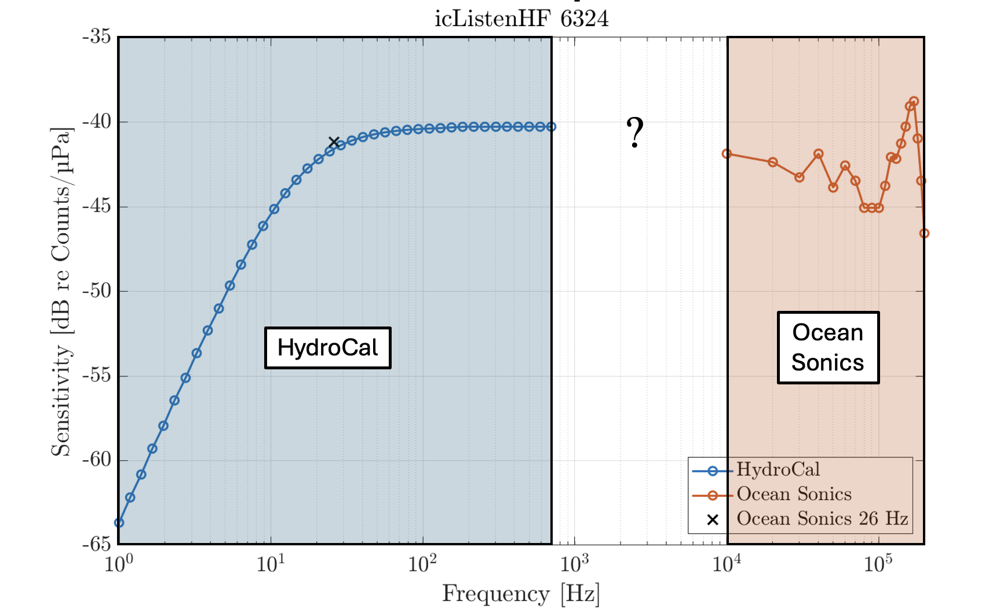

::: {.callout-important appearance="simple" style="color: #d32f2f; border-left-color: #d32f2f; background-color: #ffebee;"}
## Improvements for this page
* not complete
* annotate the first photo
* there are cool images with annotations in the hydrocal pdf
:::

A hydrophone does not "hear" all frequencies equally.
It might be increadibly sensitive at 10 kHz and deafen by 100 kHz, or vice-versa.
This is why we have LF and HF hydrophones.


# HydroCal

[HydroCal User Manual](https://internal.oceannetworks.ca/pages/viewpage.action?pageId=216205588&spaceKey=MO&title=Hydrocal%2B-%2BHydrophone%2BCalibration%2BSystem&preview=/216205588/216205599/ONC-HydrophoneCalibrationUserManual_22_03_000.pdf)

Ocean Networks Canada Hydrophone Calibration System, known as **ONC HydroCal**, is designed to perform two types of hydrophone calibrations: very low frequency (VLF) calibrations and high frequency (HF) calibrations.


## Ocean Sonics devices
Ocean Sonics calibrates their hydrophones at high frequencies (10 to 200 kHz), as well as at a single low-frequency point 26 Hz.
HydroCal was developped to also calibrate ONC's devices at low-frequencies (0.1 to 700 Hz), measure in-house by engineers at the MTC.
The LF  calibration is validated against Ocean Sonic's 26 Hz.

The mid-range frequencies (700 Hz to 10 kHz) are not calibrated, but the curve is interpolated in between.

## Geospectrum devices
??

# Sensitivity Curve
The hydrophone sensitivity curve is what is used to correct the measured sound levels by adding an offset.

{width=70%}

Along with downloading hydrophone data, a .txt file containing the sensitivity calibration curve is made readily available.

## Past issues
The ONC calibration curve was errounously calculated at very low frequencies. 
Therefore, the LF data seemed louder than it actually was.
ONC is currently working towards implementing the new corrected calibration curve, and will have to re-generate all the previously archived data products.

# Tank Test

Test tanking is a crucial validation step before a hydrophone goes in the ocean.

* Examine for anything loose to prevent leaks, vibrations, things getting away


# Validation

We will be adding an additional validation method for hydrophones to meet the new ISO standard 7605, by using pistonphone to check calibration right before deployment, ideally on the ship.


paper:

* https://ieeexplore.ieee.org/abstract/document/6964377
* https://ieeexplore.ieee.org/abstract/document/7404600
* https://ieeexplore.ieee.org/abstract/document/8084773
* https://ieeexplore.ieee.org/stamp/stamp.jsp?tp=&arnumber=10754545

# Useful links

```{=html}
<div style="border: 1px solid rgba(255, 255, 255, 0.2); 
            border-radius: 8px; 
            padding: 16px; 
            background: rgba(255, 255, 255, 0.05); 
            margin-top: 15px;
            backdrop-filter: blur(5px);
            color: white;">

  <div style="display: flex; align-items: center; gap: 12px; margin-bottom: 12px;">
    
    <span style="font-weight: bold; font-size: 1.1em; letter-spacing: 0.3px;">
      Confluence Documentation
    </span>
  </div>

  <ul style="list-style-type: none; padding-left: 36px; margin: 0;">
    

	<li style="margin-bottom: 10px;">
      <a href="https://internal.oceannetworks.ca/spaces/MO/pages/216205588/Hydrocal+-+Hydrophone+Calibration+System?preview=/216205588/216205599/ONC-HydrophoneCalibrationUserManual_22_03_000.pdf" 
         style="color: #82caff; text-decoration: none; font-weight: 500; border-bottom: 1px solid rgba(130, 202, 255, 0.3);">
         HydroCal User Manual
      </a>
    </li>

  </ul>
</div>
```

```{=html}
<div style="border: 1px solid rgba(255, 255, 255, 0.2); 
            border-radius: 8px; 
            padding: 16px; 
            background: rgba(255, 255, 255, 0.05); 
            margin-top: 15px;
            backdrop-filter: blur(5px);
            color: white;">

  <div style="display: flex; align-items: center; gap: 12px; margin-bottom: 12px;">
    
    <span style="font-weight: bold; font-size: 1.1em; letter-spacing: 0.3px;">
      Alfresco Documentation
    </span>
  </div>

  <ul style="list-style-type: none; padding-left: 36px; margin: 0;">
    <li style="margin-bottom: 10px;">
      <a href="https://docs.oceannetworks.ca/share/page/site/corporate-docs/document-details?nodeRef=workspace://SpacesStore/300293c5-17bc-4709-a7e8-459106e15529" 
         style="color: #82caff; text-decoration: none; font-weight: 500; border-bottom: 1px solid rgba(130, 202, 255, 0.3);">
         Hydrophone Calibration System
      </a>
	</li>

  </ul>
</div>
```