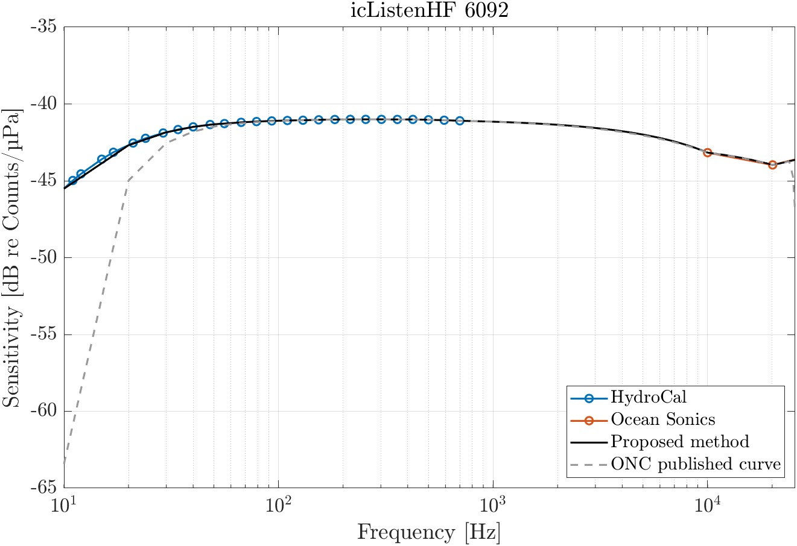
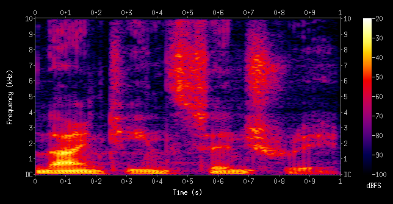

::: {.callout-important appearance="simple" style="color: #d32f2f; border-left-color: #d32f2f; background-color: #ffebee;"}
## Improvements for this page
* Sensitivity, SNR, other hydrophone types
* references
:::

# General

A hydrophone is a device that passively detects acoustic signal underwater. The word *hydrophone* comes from the Greek *hydro* (water), and *phone* (voice).

Acoustic data are recorded in the form of a time-amplitude signal, at a specified sampling rate.

Several types of hydrophones exist depending on the applications, with different frequency range. Some of the most common applications of **passive acoustics** are:


::: {.aside}
**Passive acoustics**: Action of listening to sound without emitting a signal, whereas in active acoustics the emitted signal is then analysed.
:::

- marine mammal monitoring
- ambient noise characterization
- earthquakes detection 


# From Pressure to Voltage

Hydrophones contain a key element, a **piezoelectric** material, which "feels" the pressure changes of a passing sound wave, and convert them into electric signals.
In such, hydrophones are essentially **transducers**, as they simply convert potential energy into electrical energy.

::: {.aside}
**Piezoelectric**: Material that generates an electric charge in response to applied mechanical stress. As a wave passes, it compresses the ceramic, which creates a proportional electrical voltage.
:::

::: {.aside}
**Transducer**: A device that converts energy from one form (acoustic pressure) to another (electrical voltage).
:::

The relationship between the pressure (p) and the voltage (V) is determined by the sensitivity of the hydrophone, usually expressed in dB re 1V/μPa.


The piezoelectric material is often made of ceramics, more specifically Lead-Zirconate-Titanate (PZT) compounds, which are relatively low cost, and have an excellent piezoelectric coefficient. It also has high sensitivity and can operate at wide range of temperatures.

The transducer is often shaped as a cylinder or a sphere, which is ideal for listening to signal from all direction.

# Sensitivity
The sensitivity of the hydrophone refers to how efficient the hydrophone converts underwater sound pressure into an electrical signal.
Quantitatively, it is the ratio of sound pressure signal and the output voltage signal:
$$
M_\nu = \frac{V_h}{P_h} \ \ ; \ \ \text{units:} \left[ \frac{V}{\mu Pa} \right]
$$

What affects hydrophone sensitivity:

- **Hydrophone type**: size, design and choice of material (e.g. piezoelectric compound);
- **Frequency**: piezoelectric hydrophones have a resonance frequency which depends on the piezoelectric material. Sensitivity is usually good below the resonance frequency and drops rapidly above. 
- **Environmental conditions**: water temperature, salinity and pressure can substantially impact hydrophone sensitivity. It is important to calibrate the instrument relative to those conditions.

Knowing the sensitivity is essential to choose the right hydrophone for the right application.

Hydrophones can be separated into three categories with overlapping ranges:

- Low-Frequency (Infrasonic): 1 Hz - 1 kHz
- Audio-Frequency: 10 Hz - 10 kHz
- High-Frequency (Ultrasonic): 10 Hz - 200 kHz




# Signal Processing Methods

Several methods are used to convert the recorded electric signal in data we can analyze. One method is **Fourier Analysis**, where the total signal is decomposed into a set individual frequencies with associated phase and amplitudes.

::: {.aside}
**Fourier Analysis**: Signal decomposition method where a complex signal is expressed as superimposition of simple sine and cosine waves of different frequencies.
:::


This way, a time-domain signal is converted into a frequency-domain signal which makes it easier to capture at which frequency most of the energy is.
For long periods of sound recording, the signal can be divided into shorter segments of equal lengths, specified by a *time-window*. The result shows how the spectra changes with time, the **spectrogram**.

::: {.aside}
**Spectrogram**: A visual, three-dimensional representation of a signal's frequency spectrum as it changes over time
:::



The x-axis is time, the y-axis represents the frequencies in Hz (per second), while the colors represent the level, expressed in logarithm of the signal power in dB.

Note on choosing the window: it’s impossible to have a good resolution in time and frequency at the same time (Heisenberg’s uncertainty principle).

- Short window = good time resolution, poor frequency resolution
- Long window = good frequency resolution, poor time resolution


Hydrophones can be put into three categories, infrasonic, ultrasonic, and ??

## Signal to Noise ratio
Signal to Noise ratio is an important element to consider for hydrophones.

A bigger element increases sensitivity, but also can lower SNR.

A rule of thumb is to ensure the measured amplitude is at least 5 times larger than the noise equavalent pressure (NEP) of the hydrophone to maximize the signal to noise ratio (SNR).

$$
NEP [Pa] = \frac{\text{Pre-amp Noise} ~[\mu V]}{\text{Sensitivity} ~[nV~Pa^{-1}] \times \text{Pre-amp Gain}} \times 1000
$$


# Other hydrophone types
There are several types of hydrophones (e.g., needle, membrane, fiber optical, piezoelectric, accelerometer, intertia, etc.)

**Needle Hydrophone**
[](../images/needle-hydrophone.jpg)

# Passive acoustics applications

Passive acoustic monitoring is frequently associated with underwater soundscapes. However, its utility extends far beyond physical oceanography. The versatility of hydrophone technology enables applications ranging from global seismology and tsunami detection to precision medical diagnostics and therapeutic monitoring. The following table categorizes these diverse applications and their associated frequency requirements:


| Category  | Applications  | Frequency Range 
|--------|--------|--------|
| <span style="color: darkorange;">**Seismic & Geophisics**</span> | Earthquakes, Tsunami detection, Oil & Gas exploration, Seabed mapping, Subsea leakage.   | **Sub Hz - 100 Hz** |
| <span style="color: green;">**Biological**</span>  | Marine mammal vocalization, Ecosystem studies  | **10 Hz - 100 kHz** |   
| <span style="color: skyblue;">**Natural Ambient**</span>  | Ambient noise monitoring.  | **10 Hz - 1000 Hz** |   
| <span style="color: red;">**Naval & Surveillance**</span>  | Submarine/Vessel detection, harbor surveillance.  | **3 kHz – 300 MHz** |   
| <span style="color: gold;">**Communication**</span> | Submarine communication, navigation. | **3 Hz – 300 kHz** |
| <span style="color: teal;">**Biomedical Ultrasonic**</span> | Medical imaging (dermatology, ophthalmology), HIFU therapy, and lithotripsy.| **2 – 15 MHz** |


```{python}
#| label: map-output
#| fig-cap: "Comparison of frequency ranges across multidisciplinary hydrophone applications."
#| echo: false

import matplotlib.pyplot as plt
import numpy as np
import matplotlib.ticker as ticker

# --- Data ---
data = [
    {"cat": "Seismic & Geophysics", "low": 0.1, "high": 100, "color": "darkorange"},
    {"cat": "Biological", "low": 10, "high": 150000, "color": "green"},
    {"cat": "Natural Ambiant", "low": 1, "high": 1000, "color": "skyblue"},
    {"cat": "Naval & Surveillance", "low": 3000, "high": 300000000, "color": "red"},
    {"cat": "Communication", "low": 3, "high": 300000, "color": "gold"},
    {"cat": "Biomedical Ultrasonic", "low": 2e6, "high": 15e6, "color": "teal"}
]

freq_bands = [
    {'cat': 'Infrasound', 'low': 0.1, 'high': 20, 'color': '#e74c3c'},
    {'cat': 'Audible', 'low': 20, 'high': 20000, 'color': '#f1c40f'},
    {'cat': 'Ultrasound', 'low': 20000, 'high': 300000000, 'color': '#2980b9'},
    #{'cat': 'Hypersound', 'low': 5e8, 'high': 1e10, 'color': '#95a5a6'},
]

# Sort by lowest frequency
data.sort(key=lambda x: x["low"])

# Setup vertical positions
band_y = 0  # All physical bands go on line 0
gap = 1.2
app_y = np.arange(len(data)) + gap

# --- Plotting ---
plt.rcParams['font.family'] = 'sans-serif'
fig, ax = plt.subplots(figsize=(7, 4), dpi=100)

ax.patch.set_alpha(0.0)

# plot physical frequency bands (all on line 0)
for d in freq_bands:
    # capstyle='butt' provides the squared edges
    ax.hlines(y=band_y, xmin=d['low'], xmax=d['high'], color=d['color'], 
              linewidth=22, alpha=0.3, capstyle='butt')
    
    # Label the bands in the center of their segment
    # (Using geometric mean for better centering on a log scale)
    midpoint = np.sqrt(d['low'] * d['high'])
    ax.text(midpoint, band_y, d['cat'], ha='center', va='center', 
            fontsize=9, fontweight='bold', color='#333')

# plot applications frequency bands (individual lines)
for i, d in enumerate(data):
    ax.hlines(y=app_y[i], xmin=d['low'], xmax=d['high'], color=d['color'], 
              linewidth=12, alpha=0.15, capstyle='butt')
    ax.scatter([d['low'], d['high']], [app_y[i], app_y[i]], color=d['color'], 
               s=60, zorder=3, edgecolors='k', alpha=0.7)

# --- Styling ---
ax.set_xscale('log')
ax.invert_yaxis() 

# Setting Y-axis Labels
ax.set_yticks(np.append([band_y], app_y))
ax.set_yticklabels(['Physical Bands'] + [d['cat'] for d in data], 
                   fontsize=10)

# X-Axis Tick Formatting
xticks = [0.1, 1, 10, 100, 1000, 10000, 100000, 1000000, 10000000, 100000000]
xtick_labels = ['0.1Hz', '1Hz', '10Hz', '100Hz', '1kHz', '10kHz', '100kHz', '1MHz', '10MHz', '100MHz']
ax.set_xticks(xticks)
ax.set_xticklabels(xtick_labels, fontsize=9)
ax.xaxis.set_minor_locator(ticker.LogLocator(base=10.0, subs=np.arange(1, 10)))

for s in ['top', 'right']: ax.spines[s].set_visible(False) # spines
    
ax.set_xlabel('Frequency (log Hz)', fontsize=10, labelpad=15)
ax.set_title('Passive Acoustics Applications Frequencies', weight='bold', fontsize=14, pad=25)

plt.tight_layout()
plt.show()
```

# List of technical specs for hydrophones

# References
- Suedel et al., 2019. Evaluating Effects of Dredging-Induced Underwater Sound on Aquatic Species: A Literature Review. Technical Report. [[pdf]](https://erdc-library.erdc.dren.mil/server/api/core/bitstreams/3ac0905e-e622-4b9d-851d-5d9d7c2911e5/content)
- Shah et al., 2011. Manual of Ultrasound. [[pdf]](https://www.pih.org/sites/default/files/2017-07/6e013074d8f4c4c7d8_mlblfxb8q.pdf)


# Useful links


```{=html}
<div style="border: 1px solid rgba(255, 255, 255, 0.2); 
            border-radius: 8px; 
            padding: 16px; 
            background: rgba(255, 255, 255, 0.05); 
            margin-top: 15px;
            backdrop-filter: blur(5px);
            color: white;">

  <div style="display: flex; align-items: center; gap: 12px; margin-bottom: 12px;">
    
    <span style="font-weight: bold; font-size: 1.1em; letter-spacing: 0.3px;">
      Confluence Documentation
    </span>
  </div>

  <ul style="list-style-type: none; padding-left: 36px; margin: 0;">
    <li style="margin-bottom: 10px;">
      <a href="https://internal.oceannetworks.ca/spaces/ONCData/pages/255101696/2.+Sensitivity+curve+interpolation" 
         style="color: #82caff; text-decoration: none; font-weight: 500; border-bottom: 1px solid rgba(130, 202, 255, 0.3);">
         Sensitivity Curve Interpolation
      </a>

	</li>
	<li style="margin-bottom: 10px;">
      <a href="https://internal.oceannetworks.ca/spaces/ONCData/pages/216205790/Passive+acoustics" 
         style="color: #82caff; text-decoration: none; font-weight: 500; border-bottom: 1px solid rgba(130, 202, 255, 0.3);">
         Passive Acoustics
      </a>
    </li>

  </ul>
</div>
```


```{=html}
<div style="border: 1px solid rgba(255, 255, 255, 0.2); 
            border-radius: 8px; 
            padding: 16px; 
            background: rgba(255, 255, 255, 0.05); 
            margin-top: 15px;
            backdrop-filter: blur(5px);
            color: white;">

  <div style="display: flex; align-items: center; gap: 12px; margin-bottom: 12px;">
    
    <span style="font-weight: bold; font-size: 1.1em; letter-spacing: 0.3px;">
      Alfresco Documentation
    </span>
  </div>

  <ul style="list-style-type: none; padding-left: 36px; margin: 0;">
    <li style="margin-bottom: 10px;">
      <a href="https://docs.oceannetworks.ca/share/page/site/corporate-docs/document-details?nodeRef=workspace://SpacesStore/300293c5-17bc-4709-a7e8-459106e15529" 
         style="color: #82caff; text-decoration: none; font-weight: 500; border-bottom: 1px solid rgba(130, 202, 255, 0.3);">
         Hydrophone Calibration System
      </a>

	</li>
	<li style="margin-bottom: 10px;">
      <a href="https://docs.oceannetworks.ca/share/page/site/operations-docs/document-details?nodeRef=workspace://SpacesStore/e2ccb4a3-7a26-4811-acc7-6073ff1e49cd" 
         style="color: #82caff; text-decoration: none; font-weight: 500; border-bottom: 1px solid rgba(130, 202, 255, 0.3);">
         Hydrophone System
      </a>
    </li>

  </ul>
</div>
```
