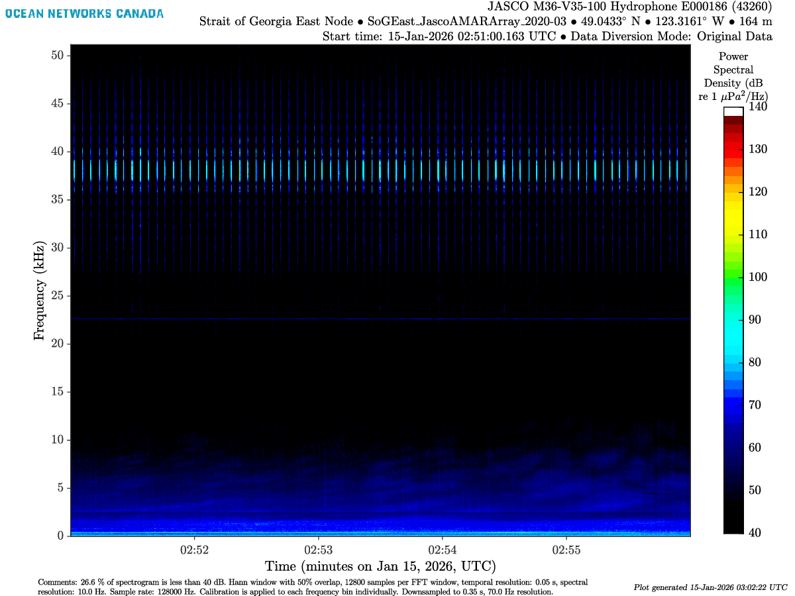
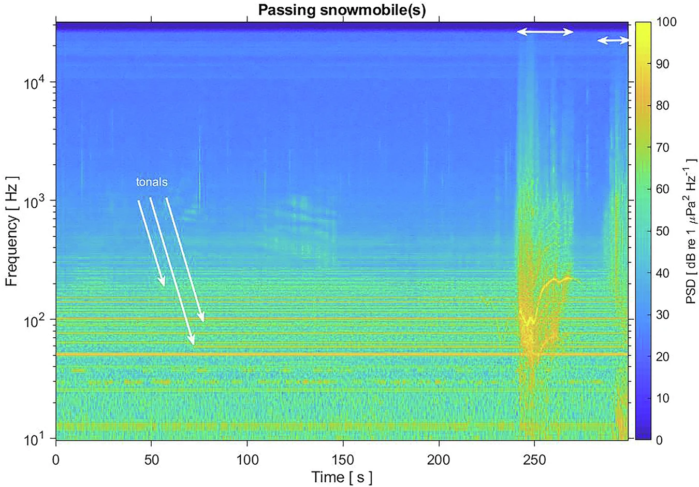
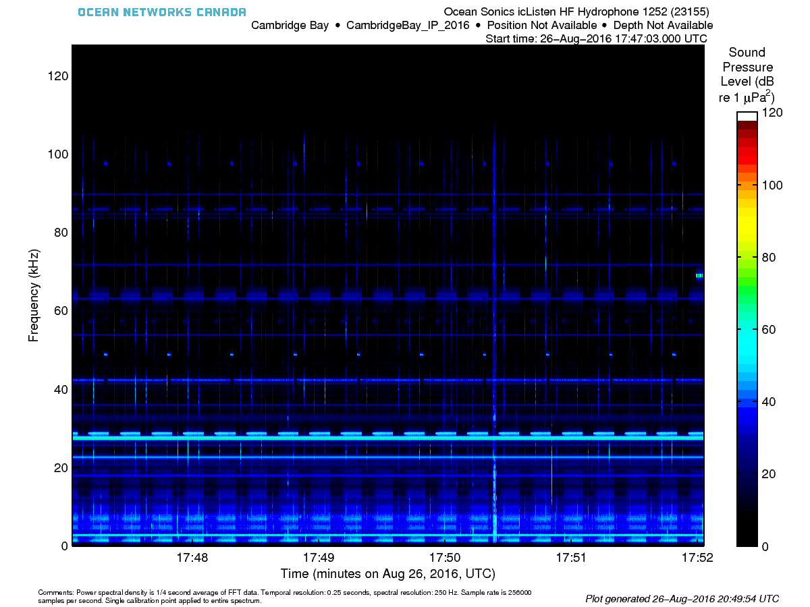

Explore acoustic signatures captured across our monitoring stations.
Examples shown here are include marine mammals, interference from nearby instruments, weather events.

Go to [ONC's soundcloud page](https://soundcloud.com/oceannetworkscanada) to get the full list of sounds discovered from the hydrophone data.

More examples on [Voices in the Sea](https://voicesinthesea.ucsd.edu/index.html)

<!--
---


# Template

::: {layout="[[35, 65]]"}
::: {#metadata}
**Location:** Strait of Georgia East, BC  
**Sounds:** Tonal

**Analysis:** Constant

:::

{}
:::

-->

# Acoustic Interference from Nearby Instruments

::: {layout="[[35, 65]]"}
::: {#metadata}
**Location:** Strait of Georgia East, BC  
**Sounds:** Tonal, Interference

**Explanation:** An ADCP is located very close to the hydrophone, resulting in a strong signal between 35 and 40 kHz. A tonal line is seen around 22 kHz.

:::

{}
:::


# SONAR

::: {layout="[[35, 65]]"}
::: {#metadata}
**Location:** Clayoquot Slope, BC
**Sounds:** SONAR at 2 kHz and 7 kHz.

:::

{}
:::


# Airplane

::: {layout="[[35, 65]]"}
::: {#metadata}
**Location:** Cambridge Bay, NU
**Sounds:** Airplane flying over.

:::

{}
:::


# Tonals

::: {layout="[[35, 65]]"}
::: {#metadata}
**Location:** Strait of Georgia East, BC  
**Sounds:** Tonal

**Explanation:** Stationary signal at a single frequency that often results from power-related issues within the system. These may not be related to the hydrophone itself and therefore may remain even when a hydrophone is replaced with a new one.

:::

{}
:::


# Snowmobile

::: {layout="[[35, 65]]"}
::: {#metadata}
**Location:** Cambridge Bay, NU  
**Sounds:** Snowmobile Transit, Tonals

**Explanation:** The soundscape is dominated by surface-coupled noise. In winter, snowmobiles create distinct harmonic bands ($10^2$ to $10^3$ Hz). These overlap with ringed seal vocalizations, creating a high risk of **acoustic masking** in shallow ice-covered leads.

Link to the article: [Marine soundscapes of the Arctic and human impacts: going beyond the "shipping bands"](https://www.nature.com/articles/s44384-025-00038-1)

:::

{}
:::

::: {layout="[[35, 65]]"}
::: {#metadata}
**Location:** Cambridge Bay, NU  
**Sound:** Snowmobile Transit

:::

{}
:::


# Earthquake at Endeavour

::: {layout="[[35, 65]]"}
::: {#metadata}
**Location:** Endeavour, Pacific Ocean

**Sounds:** Earthquake

**Explanation:** Earthquake soudns are mostly detectable at low frequency. Find more information about this event on this [ONC Storymap](https://www.google.com/url?sa=j&url=https%3A%2F%2Fwww.oceannetworks.ca%2Fnews-and-stories%2Fstories%2Fendeavour-site-records-the-highest-level-of-earthquake-activity-in-20-years%2F&uct=1776699136&usg=oaC1vpRu1MP3K32B5P4u88gMRrw.&opi=73833047&source=chat).

:::

{}
:::


# Pump contamination

::: {layout="[[35, 65]]"}
::: {#metadata}
**Location:** Cambridge Bay, NU
**Sounds:** Pump

**Analysis:** At that time, the hydrophone was too close to a plafform with other noisy instruments which included a pump.
:::

{}
:::

---

# Useful Links

```{=html}
<div style="border: 1px solid rgba(255, 255, 255, 0.2); 
            border-radius: 8px; 
            padding: 16px; 
            background: rgba(255, 255, 255, 0.05); 
            margin-top: 15px;
            backdrop-filter: blur(5px);
            color: white;">

  <div style="display: flex; align-items: center; gap: 12px; margin-bottom: 12px;">
    
    <span style="font-weight: bold; font-size: 1.1em; letter-spacing: 0.3px;">
      Confluence Documentation
    </span>
  </div>

  <ul style="list-style-type: none; padding-left: 36px; margin: 0;">
    <li style="margin-bottom: 10px;">
      <a href="https://internal.oceannetworks.ca/spaces/ONCData/pages/13648503/Hydrophone+daily+checks" 
         style="color: #82caff; text-decoration: none; font-weight: 500; border-bottom: 1px solid rgba(130, 202, 255, 0.3);">
         Hydrophone Daily Checks
      </a>

  </ul>
</div>
```
