<!-- ::: {.callout-important appearance="simple" style="color: #d32f2f; border-left-color: #d32f2f; background-color: #ffebee;"}
## Improvements for this page
:::
-->

In the ocean, light attenuates rapidly, whereas sound can travel thousands of kilometers, making sound is the primary sense for communication and navigation for marine mammals and human underwater telecommunications.

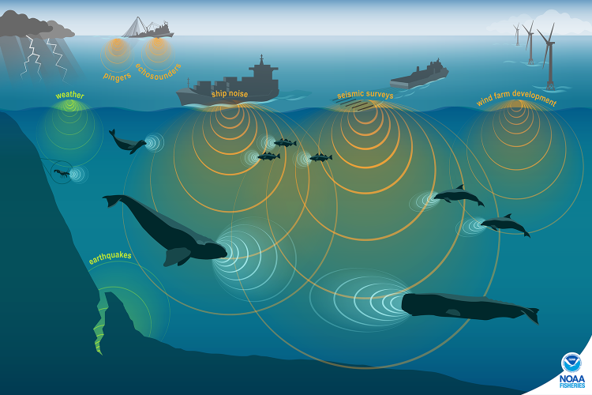

# What is sound?

Sound is created by a vibrating object which compressesion and expansion produces a pressure difference which generates a sound wave that propagates.
The resulting sound wave is a longitudinal oscillatory wave, which travels through a medium (e.g., water, air) as alternating high and low pressures.
As sound propagates under water, it induces lateral movement of water molecules which creates pressure change.
The closer the molecules, the tighter their bonds, the less time it takes to pass the sound to each other.

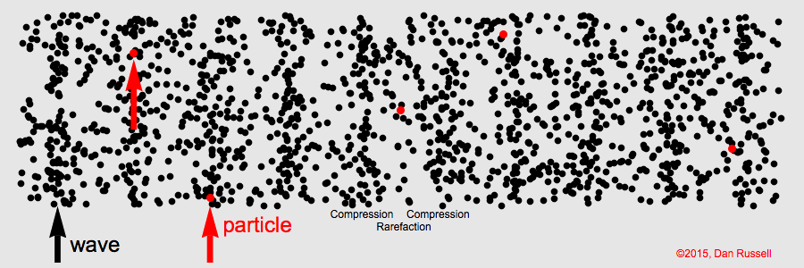

Note that a sound wave is omnidirectional, meaning that it propagates in all directions.

## Sound characterization

Sound is described by characteristics that can be measured:

* Loudness is measured by intensity: how much particles move. The amplitude of a wave is related to the amount of energy it carries.
The intensity of a sound wave is defined as the energy transmitted through a unit area, per unit time, in the direction in which the sound wave is traveling; it is a vector quantity having both a magnitude and direction.
Relative intensity is given in dB.

* Pitch is measured by frequency: how often particles move
* Phase cannot be heard. It specifies the location 

[high frequency vs low frequency image](frequency.png)

In general, larger objects produce low-frequency sounds.

## Key wave characteristics:

* Amplitude: measured in decibels (dB), it represents the energy/intensity of the wave.
* Frequency ($f$): measured in Hertz (Hz), it defines the pitch.
* Wavelength ($\lambda$): related to speec ($c$) and frequency by $c=f\lambda$.

## Why does sound travel faster in water than air?

Sound travels roughly 4.3 times faster in water than in air ($\approx 1500$ m/s in water vs 340 m/s in air).
he speed of sound ($v$) is governed by the relationship between a material's **bulk modulus** (B), its resistance to compression) and its **density** ($\rho$):

::: {.aside}
**Bulk Modulus**: The *stiffness*, or resistance to compression of a medium, which depends on the medium's density: $B=\rho \partial P / \partial \rho$.
:::

$$
v = \sqrt{\left(B/\rho\right)}
$$

While water is 800 times denser than air (1000 kg/m vs 1.2 kg m/3), it is also 20,000 times *less* compressible than air.
The extreme stiffness of seawater allows for kinetic energy to transfer more efficienttly between molecules and as a result, sound to travel much fast underwater.

# Sound speed profile

The speed of sound in the ocean is not constant.
It depends on the environmental conditions, and fluctuates with temperature, salinity, and pressure (depth).
An approximate change of sound speed per change in property:

* Temperature: $\Delta T$ 1°C = 4 m/s
* Salinity: $\Delta S$ 1 psu = 1 m/s
* Depth (pressure): $\Delta z$ 1 km = 17 m/s

The change of sound speed with depth is called a sound speed profile:

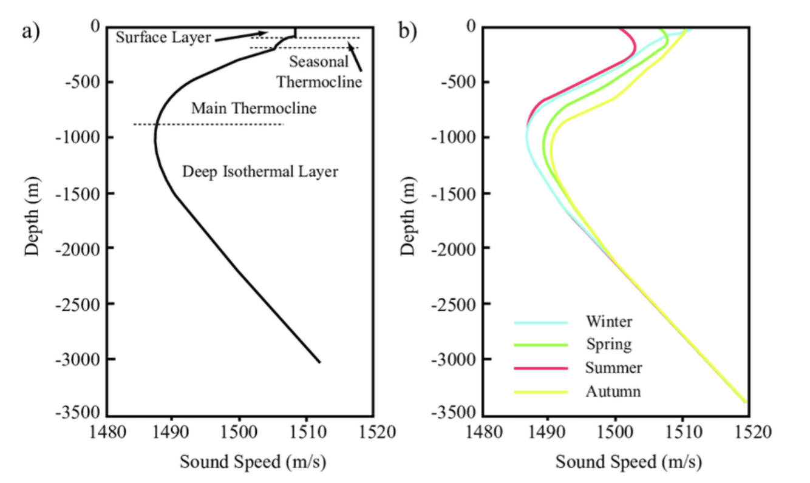

In general,

* sound speed decreases with temperature, which we can see near the surface where temperatures change by a lot within a few meters
* sound speed increases with pressure, which we can see at depth where temperature is nearly constant but pressure keeps increasing
* salinity has small impact on sound speed since it doesn't vary much, except in estuaries where salinity varies greatly

# Ocean acoustic wave guides

## SOFAR channel (ocean acoustic waveguide)

There's a unique sweet spot at about 1000 m where sound emitted at this depth can travel much farther away, known as the SOFAR channel (SOund Fixing And Ranging).
This is a result of decrease in temperature and the increase in pressure making sound speed reach a miniumum.
Because of **refraction**, sound waves always bend toward regions of slower speed.
As a result, any sound waves traveling upward or downward from this 1000-meter layer are continuously bended right back into the center of the low-speed layer.

::: {.aside}
**SOFAR channel**: The specific depth range at which the speed of sound reaches a minimum, usually around 1000 m.
:::

::: {.aside}
**Refraction**: The bending of a wave as it moves through changing water properties (temperature, pressure, salinity) Sound will bend from high sound speed to low sound speed (Snell’s law).
:::

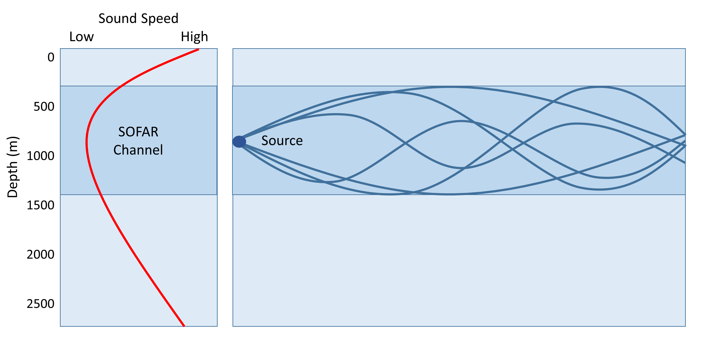

This deep channel is also called an ocean waveguide, where inside acoustic energy does not escape and thus can travel great distances.
This channel has several useful applications:

* **Marine mammals** use it for communications with low-frequency sounds across thousands of kilometers.
* **The Military** during WWII used it to locate downed aviators, which would released small detonations within the SOFAR channel detectable far away.

## Surface Duct

Similar to the SOFAR Channel, the Duct surface channel is a channel where sound gets trapped, within *** of the surface.
This is due to ...

Surface sound channel where all sound waves bend upwards.

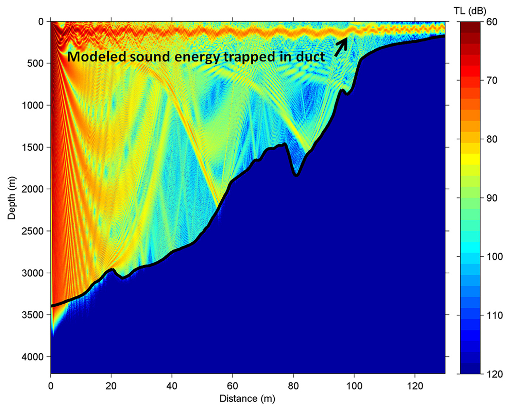

# Wave behaviours

The propagation path of a sound wave is nearly nevery linear.
Temperature and pressure variations create a sound speed profile that refracts acoustic rays.
Surface like the sea bed and sea surface reflect the sound wave, creating echoes.
This sound wave distortion creates a complex pathway propagation which can result in shadow zones, where no sound can be heard.

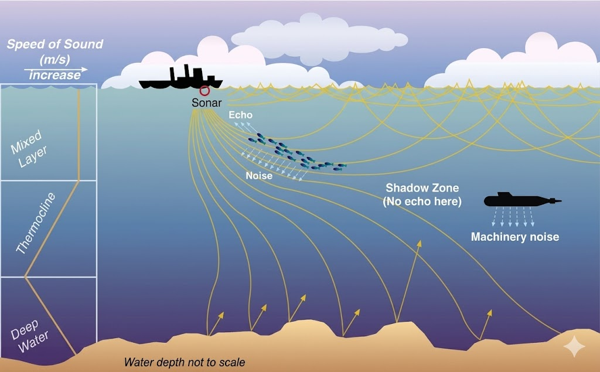

Here are the descriptions of such behaviours that may affect the sound propagation path and intensity.

## Absorption
As sound travels through water, it gets *absorbed*, caught by the molecules which vibrate and transform the wave energy into heat.
As a result, the sound wave amplitude decreases as it propagates.
High frequency sound gets absorbed faster, so high frequency sounds do not travel as far as low frequency sounds.

## Attenuation
A sound wave is spherical, with propagation in all directions.
As it propagates, the aplitude (or intensity) is reduces (~ $1/r^2$) due to absorption or scattering within the surrounding medium (sea water).
Attenuation is very small for low frequencies, so sounds like doplhin clicks are absorbed rapidly and vanish, while whale calls or ships rumbles can propagate across entire ocean basins with minimal energy loss.

## Diffraction
Diffraction occurs when a sound wave is partially obstructed.
The rays behind a wall (or sea mount) are reflected.

## Reflection
Sound waves reflect and bounce off a surface (e.g., sea surface, sea floor), creating echoes.
Elements like sea floor sediment types can impact reflection efficiency.

A seafloor of hard bedrock and is a better reflector than watery sand.

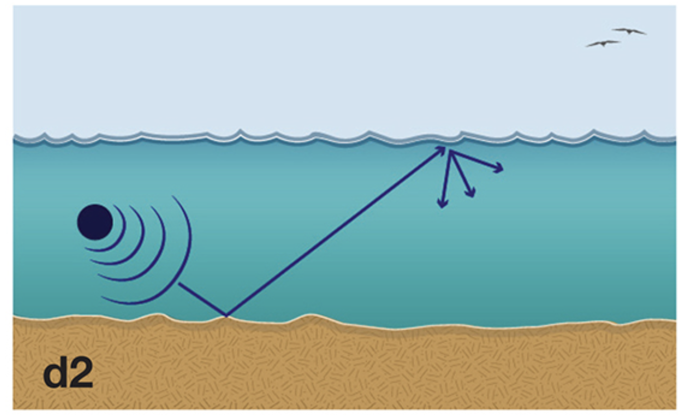{width=60%}

## Interference
Multiple paths can create constructive and destructive interference.
When a sound is emitted and propagates, the sound waves take different paths from reflecting and bouncing around.
They arrive at the same hydrophone at slightly different times, causing their waveforms to overlap and create interference.

* constructive interference: two peaks arrive exactly at the same time, reinforcing their intensity and creating an artificially loud sound.
* destructive interference: the trough of one aligns with the peak of the other, annulling the signal which can make the sound completely disappear.

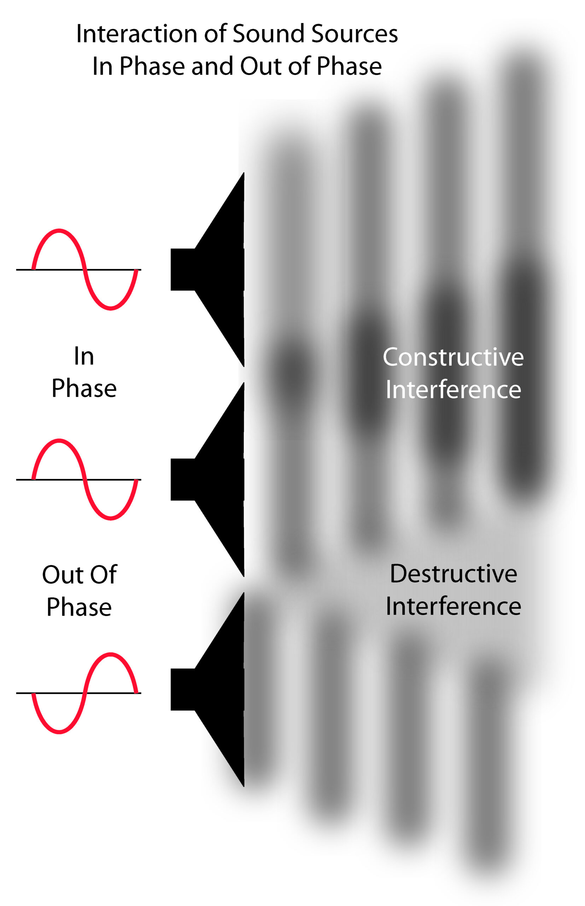{width=40%}

## Refraction
Refraction is the change of direction (also bending) of sound propagation, due to changes in the sound speed from changes in temperature, salinity, or pressure.

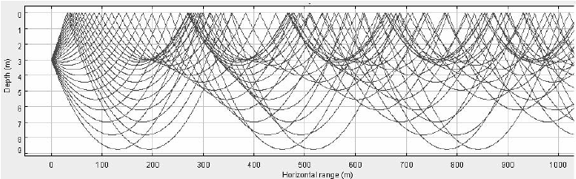

The refraction angle (direction) follows Snell's Law:

$$
\frac{\sin{\theta_1}}{\sin{\theta_2}} = \frac{c_1}{c_2}
$$

The frequency of the sound wave does not change while being refracted, but its wavelength might depending on the refracted angle and its velocity ($c=\lambda f$).

Two wave guides in the ocean are a result of refraction: the SOFAR channel, and the surface duct.

## Scattering
When a sound wave encouters a boundary (sea surface, sea floor, sea mount, marine animal), the wave is reflected if the surface is smooth.
In case of a rough surface or complex medium (bubbles, turbulence, heavy storm, small fishes, suspended sediments), the sound wave is reflected in many directions all at once.
This causes the sound to disperse in random direction and the acoustic signal loses energy quickly.

## Reverberation
Reverberation is not exactly a wave behaviour, but rather the result of it.
It is the accumulation of sound that have been scattered and persists even if the source is turned off.
It can limit sound detection due to clouding the incoming signal.
It is even more important in shallow water, as sound interacts multiple times with the surface and the bottom as it travels.

# Transmission Loss
Transmission loss has three components: spreading, scattering, and attenuation.
It is the total loss of energy from the source to a receiver, also known as propagation loss.

Received Level = Source Level - Propagation Loss - Excess Attenuation
RL = SL - 20 log10 (r) - EA (independant of the frequency, only on the geometry of the source and sound field)

EA = \alpha * r + reflection + scattering + diffraction

When a wave passes through a medium, a portion of the energy is lost due to multiple factors.
A wave loses energy as it travels, and we quantify this as the transmission loss.
Examples of mechanisms that can result in transmission lost are wave attenuation, geometrical spreading, bottom reflection loss, boundary scattering.

# Arctic propagation

## How does sea ice affect how sound travel?
When sea ice is present, the upward bending sound waves constantly interact with the rough sea ice surface which creates constant scattering.
Historically, this instance scattering has limited long-range sound propagation to frequencies below 30 Hz.
Under global warmin, the Arctic has warmed and sea ice extent has decreased dramatically, affecting how sound travels and making higher frequencies travel longer ranges than before.

## The polar sound speed profile
The sound profile in polar regions varies differently than in temperate regions.
Unlike temperate oceans, polar temperatures are much less variable with depth, which lead to specific arctic sound speed characteristics:

* **wintertime**: sound speed minimum sits at the surface. Because sound speed increases with depth, sound waves are constantly refracted upward towards the surface, causing massive energy loss through intense scattering against sea ice.
* **summertime**: solar heating warms the upper layer, shifting the sound speed minimum, and.sub-surface duct, at around 150 m. This deep channel isolates sound waves from the surface, allowing high frequencies to travel much further.

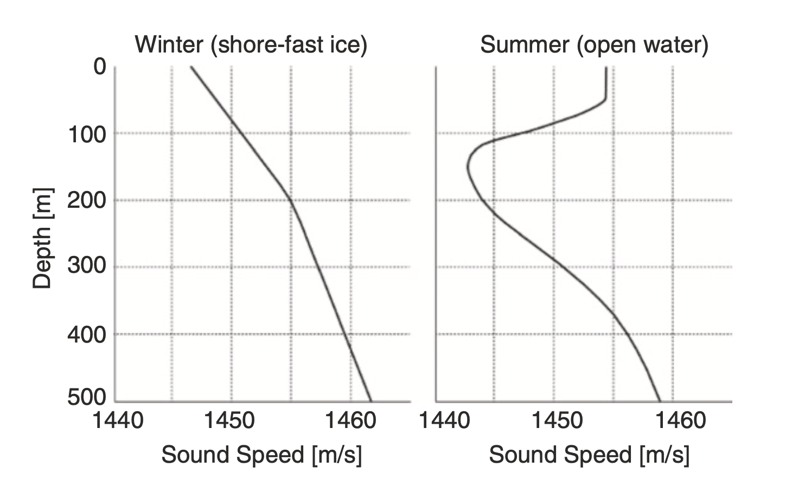{width=80%}

Read more: Ambient Noise in the Canadian Arctic, pp 105-133, from Cook, Barclay & Richards.

# Acoustic masking

Loud anthropogenic (human-made) activities can severely affect marine mammals by completely masking or interfering with the sounds they use for communication, navigation, mating, and feeding.
If the sound is loud enough, it makes the marine species' sounds undetectable to others.
Such sounds include shipping traffic, sonar, construction, airguns used to detect oil and gas below the sea floor, and military exercises.

Sound masking has led to impacting:

* physical health: some sounds can be so loud that they can destroy hearing sensitivity temporarily, and in extreme cases permanently damaging hearing.
* behavior: marine mammals can get lost, and reduce or no longer mate. 

# Propagation modelling (Ray tracing)

Modelling the propagation of a sound wave is useful for:

* identifying the location of a sound source
* assessing sound disturbance ahead of underwater work
* regulating marine traffic
* determining the optimal location for new hydrophones

Sound propagation can be described by the *wave equation*:

$$
\nabla^2 p - \frac{1}{c^2} \frac{\partial^2 p}{\partial t^2} = 0
$$

where $p$ is the acoustic sound pressure (deviation from the ambiant pressure), $c$ is the speed of sound in the medium (about 1500 m/s in seawater), and $t$ is time.  

::: {.callout-tip style="color: green; border-left-color: green; background-color: white;"}
## Theory to application
The wave equation is essential for measuring sounds, as it is the fundamental physics that allows us to convert the changes in voltage recorded by the hydrophones into the physical pressure waves.
:::

Several numerical models have been developed in order to predict sound propagation, each with limitations.

For example, the sound propagation model **BELLHOP**, developed by Michael B. Porter, is a *beam tracing model*, meaning that it traces the pathway of a sound wave at a specific frequency.
The model requires knowledge of the water depth along the pathway (bathymetry), the sound speed profile (derived from T, S, p), and the sea floor composition (e.g., clay).
Ray tracing allows to predict the pathway, travel time and acoustic amplitude of a sound source.

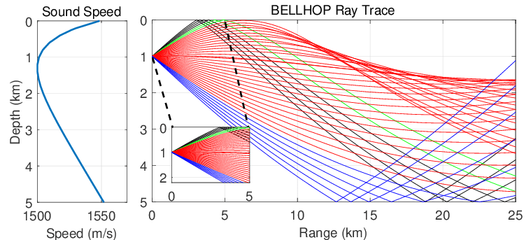

# Relevant acoustics units

## Decibel (dB)
Underwater sounds span many orders of magnitude, so sound pressure levels are measured on a base-10 logarithmic scale, called the decibel (dB).
The standard reference pressure for underwater sounds is 1 $\mu$ Pa (whereas 20$\mu$ Pa is the reference for air).

$$
SPL = 20 \log_{10} \left(\frac{p}{p_{ref}}\right)~\text{dB re 1}~\mu\text{Pa}
$$

Example: a sound wave with a pressure of 1,000,000 times greater than the reference pressure has a sound pressure level of:
$$
20 \log_{10}\left(10^6\right) = 120~\text{dB re 1}~\mu\text{Pa}
$$

## Spectral units: from space to frequency domain

The raw, continuous audio data is decomposed into individual frequencies using a Fourier Transform.
This transformation produces the **Power Spectral Density (PSD)**, expressed in units of $\text{Pa}^2/\text{Hz}$, which reflects how acoustic energy is distributed across the frequencies.

To make these values easier to read and analyze, we convert the PSD to a logarithmic scale.
The resulting **Spectrum Level** measures the acoustic intensity contained within a 1 Hz bandwidth:

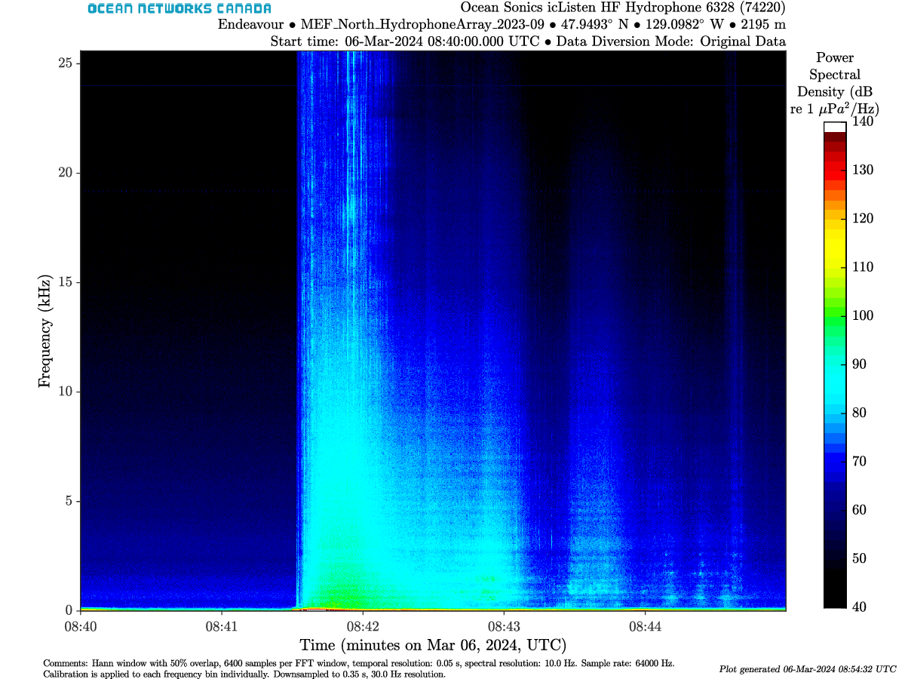{width=60%}

# Empirical equations for sound speed

Several empirical equations have been developed to accurately capture the speed of sound from these variables as a function of depth.

Mackenzie:
$$
c(T,S,z) = a_1 + a_2 T + a_3 T^2 + a_4 T^3 + a_5(S-35) + a_6 z + a_7 z^2 + a_8 T (S-35) + a_9 T z^3
$$

Del Grosso 1974:

$$
c(T,S,p) = c_{000} + \Delta c_T + \Delta c_S + \Delta c_P + \Delta c_{STp}
$$

# References
* Principles of Undewater Acoustics, Urick
* Underwater Acoustics, Hodges
* Medwin and Clay
* NOAA: [Ocean Noise](https://www.fisheries.noaa.gov/national/science-data/ocean-noise)
* Discovery of Sound in the Sea (dosits): [Science of Sound](https://dosits.org/science/sound/what-is-sound/)
* Ambient Noise in the Canadian Arctic, pp 105-133, from Cook, Barclay & Richards.

